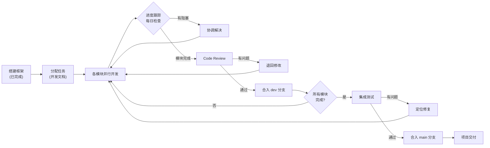
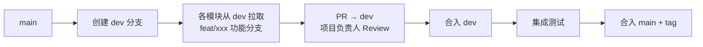
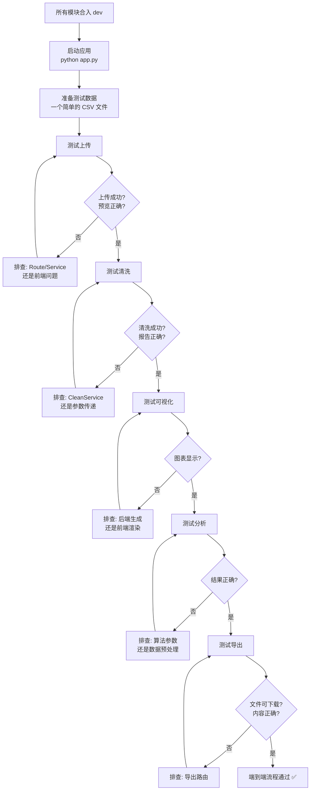

# 项目负责人 - 开发文档

**岗位**：项目负责人（Project Lead）
**负责人**：项目负责人

---

## 一、角色定位

你处于项目的**中心枢纽**位置，是唯一需要了解全局的人：

- **向下**：为各模块提供基础设施和契约约束
- **横向**：协调各模块的接口对接和进度
- **向上**：对项目整体质量和交付负责

### 你在架构中的位置

```
                    ┌──────────────────────┐
                    │   项目负责人 项目负责人       │
                    │  架构 + 集成 + 测试   │
                    └──────┬───────────────┘
          ┌─────────────────┼─────────────────┐
          │                 │                  │
    ┌─────▼──────┐   ┌─────▼──────┐    ┌─────▼──────┐
    │ 数据管理模块 │   │ 数据清洗模块 │    │ 可视化模块  │
    └─────────────┘   └─────────────┘    └─────────────┘
    ┌─────────────┐   ┌─────────────┐
    │ 分析功能模块 │   │ Web界面模块  │
    └─────────────┘   └─────────────┘
              全都在你这里集成
```

---

## 二、涉及文件清单

| 文件 | 操作类型 | 说明 |
|------|---------|------|
| `config.py` | **维护** | 全局配置项，各模块依赖 |
| `value_objects.py` | **维护** | `DatasetRef` 值对象，各模块依赖 |
| `repositories/base.py` | **维护** | `DataRepository` 抽象接口 |
| `repositories/__init__.py` | **维护** | 数据访问层包导出 |
| `services/__init__.py` | **维护** | 业务逻辑层包导出 |
| `routes/__init__.py` | **维护** | 蓝图注册 |
| `app.py` | **维护** | 应用工厂 + 依赖注入 |
| `requirements.txt` | **维护** | 依赖管理 |
| `.gitignore` | **维护** | Git 忽略规则 |
| `docs/项目开发规范.md` | **维护** | 开发规范 |
| `docs/项目集成指南.md` | **维护** | 集成指南 |
| `docs/进度跟踪.md` | **维护** | 各模块进度看板 |
| `docs/交互式数据分析系统 - 开发说明文档.md` | 只读 | 原始架构文档 |

---

## 三、核心工作流程

### 3.1 项目整体流程



### 3.2 你的日常工作流

```
每日：
  ├── 检查各模块进度（Git commit / 群内同步）
  ├── 解决阻塞问题（接口变更、依赖冲突）
  ├── Review 提交的 PR
  └── 维护通用组件（如有 Bug 修复）

里程碑：
  ├── 框架搭建完成     ← 已完成
  ├── 各模块开发完成   ← 等待中
  ├── 集成测试通过     ← 等待中
  └── 项目交付         ← 等待中
```

---

## 四、详细职责与操作指南

### 4.1 通用组件维护

你负责的通用组件是所有模块的基石，需要确保：

#### DataRepository 抽象基类

```python
# repositories/base.py
# 【核心契约】修改此文件会影响所有 Service 的实现

class DataRepository(ABC):
    def save_data(self, df, context=None) -> DatasetRef: ...
    def load_data(self, ref) -> pd.DataFrame: ...
    def delete_data(self, ref) -> None: ...
    # list_datasets() — 扩展阶段再实现
```

**维护原则**：
- 抽象接口一旦确定，尽量不修改签名
- 如需新增方法，先评估是否影响现有模块
- 接口变更需通知所有相关开发人员

#### FileRepository

```python
# repositories/file_repo.py
# 已实现 save/load/delete，但可能需增强：
# - 异常处理：磁盘空间不足、文件被占用
# - 线程安全：多请求并发访问 _ref_map
```

**后续可优化项**（视需要）：
- [ ] 添加定期清理过期文件的机制
- [ ] 添加读写锁，保证线程安全
- [ ] 增加文件完整性校验

### 4.2 依赖注入（app.py）

各模块完成后，你需要在 `app.py` 的 `create_app()` 中组装依赖链：

```python
def create_app() -> Flask:
    app = Flask(__name__)
    app.config["SECRET_KEY"] = SECRET_KEY
    app.config["MAX_CONTENT_LENGTH"] = MAX_CONTENT_LENGTH
    app.config["UPLOAD_FOLDER"] = UPLOAD_FOLDER

    # ═══════════════════════════════════════════════
    # 依赖注入（所有模块开发完成后取消注释）
    # ═══════════════════════════════════════════════
    from repositories import FileRepository
    from services import (
        DataService, CleanService,
        VisualizeService, AnalyzeService,
    )

    repo = FileRepository()
    app.data_service = DataService(repo)
    app.clean_service = CleanService(repo)
    app.visualize_service = VisualizeService(repo)
    app.analyze_service = AnalyzeService(repo)

    # 注册蓝图
    from routes import register_blueprints
    register_blueprints(app)

    # 首页路由
    @app.route("/")
    def index():
        return app.send_static_file("index.html")
        # 或 return render_template("index.html")

    # 全局错误处理
    @app.errorhandler(Exception)
    def handle_error(error):
        return {"status": "error", "message": str(error)}, 500

    return app
```

### 4.3 进度跟踪

你需要维护 `docs/进度跟踪.md`，格式如下：

```markdown
# 项目进度跟踪

更新日期：2026-06-01

## 总体进度
- [ ] 框架搭建 (100%) ✅
- [ ] 数据管理模块 (0%)
- [ ] 数据清洗模块 (0%)
- [ ] 可视化模块 (0%)
- [ ] 分析功能模块 (0%)
- [ ] Web 界面模块 (0%)
- [ ] 集成测试 (0%)

## 各模块详情

### 数据管理模块 — 负责人：A
- 状态：⏳ 开发中 / ✅ 已完成 / ❌ 阻塞
- 当前工作：
- 阻塞问题：
- 预计完成：

### 数据清洗模块 — 负责人：B
...
```

### 4.4 Git 管理

| 操作 | 命令 | 说明 |
|------|------|------|
| 创建 dev 分支 | `git checkout -b dev` | 从 main 创建开发分支 |
| 合并 PR | `git merge feat/xxx` | 在 dev 上合并功能分支 |
| 发布 | `git checkout main && git merge dev` | 集成测试通过后合入 main |
| 打标签 | `git tag v1.0.0` | 里程碑节点 |

**你的 Git 工作流**：



### 4.5 Code Review 检查清单

当各模块提交 PR 时，你需检查：

**通用检查**：
- [ ] 代码是否符合开发规范（命名、缩进、类型注解）
- [ ] 是否包含 NotImplementedError（如有，确认是故意暂缓）
- [ ] 异常是否被正确处理（没有 try/except pass）

**数据管理模块**：
- [ ] CSV 和 Excel 两种格式都支持
- [ ] 预览信息返回格式正确（columns, preview, shape, dtypes）
- [ ] 导出接口返回文件流（不是 JSON）

**数据清洗模块**：
- [ ] 清洗操作返回新 dataset_id
- [ ] 原始数据未被修改（检查 DataFrame 是否在操作前被拷贝）
- [ ] 非数值列的 mean/median 策略报错

**可视化模块**：
- [ ] 三种图表类型都支持
- [ ] 列名校验和数据类型校验到位
- [ ] 如果使用 Matplotlib，已设置 `matplotlib.use("Agg")`

**分析功能模块**：
- [ ] numpy 类型已转为 Python 原生类型（tolist/float）
- [ ] 有效样本数不足时有校验

**Web 界面模块**：
- [ ] 整个流程不需要页面刷新
- [ ] dataset_id 在每次操作后更新
- [ ] 错误信息在前端可见

### 4.6 集成测试流程



---

## 五、各模块接口速查表

作为项目负责人，你需要记住以下接口以便快速定位问题：

### HTTP API

| 路由 | 方法 | 状态 | 负责人 |
|------|------|------|--------|
| `POST /upload` | 上传文件 | 🔧 待实现 | 数据管理模块 |
| `POST /clean` | 清洗数据 | 🔧 待实现 | 数据清洗模块 |
| `POST /plot` | 生成图表 | 🔧 待实现 | 可视化模块 |
| `POST /analyze` | 执行分析 | 🔧 待实现 | 分析功能模块 |
| `GET /export` | 导出数据 | 🔧 待实现 | 数据管理模块 |

### Service 接口

| Service | 关键方法 | 状态 |
|---------|---------|------|
| `DataService` | `upload(file) → (DatasetRef, dict)` | 🔧 待实现 |
| `CleanService` | `clean(ref, missing, outlier) → (DatasetRef, list, dict)` | 🔧 待实现 |
| `VisualizeService` | `generate_plot(ref, x, y, type) → dict` | 🔧 待实现 |
| `AnalyzeService` | `analyze(ref, algorithm, params) → dict` | 🔧 待实现 |

### 前端 JS 函数

| 函数 | 所在文件 | 状态 |
|------|---------|------|
| `handleUpload(file)` | `upload.js` | 🔧 待实现 |
| `renderPreview(data)` | `upload.js` | 🔧 待实现 |
| `handleExport(id, format)` | `upload.js` | 🔧 待实现 |
| `populateCleanOptions(columns)` | `clean.js` | 🔧 待实现 |
| `collectCleanParams()` | `clean.js` | 🔧 待实现 |
| `handleClean(params)` | `clean.js` | 🔧 待实现 |
| `populatePlotColumns(columns)` | `plot.js` | 🔧 待实现 |
| `handlePlot(datasetId)` | `plot.js` | 🔧 待实现 |
| `handleAnalyze(datasetId)` | `analyze.js` | 🔧 待实现 |
| `populateAlgorithmParams(algorithm)` | `analyze.js` | 🔧 待实现 |

---

## 六、常见问题排查指南

### 6.1 应用启动失败

```
ModuleNotFoundError: No module named '...'
```
→ 检查 `requirements.txt` 是否安装了对应依赖，执行 `pip install -r requirements.txt`

```
ImportError: cannot import name 'XxxService' from 'services'
```
→ Service 模块还未实现，确认 `services/__init__.py` 中已导出

### 6.2 路由 404

```
POST /upload 404 NOT FOUND
```
→ 检查蓝图是否在 `create_app()` 中注册，检查 `routes/__init__.py` 中的 `register_blueprints`

### 6.3 路由 500

```
POST /clean 500 INTERNAL SERVER ERROR
```
→ 通常是因为被调用的 Service 方法抛出了 `NotImplementedError`，说明该模块未实现

### 6.4 前端空白/报错

```
Uncaught ReferenceError: handleUpload is not defined
```
→ JS 文件加载顺序错误，`upload.js` 必须在 `app.js` 之前加载

```
Uncaught TypeError: Cannot read properties of null
```
→ 页面中缺少对应 ID 的 DOM 元素，检查 HTML 和 JS 的 ID 是否匹配

---

## 七、里程碑与时间线建议

| 阶段 | 内容 | 预计耗时 |
|------|------|---------|
| **第 1 天** | 框架搭建 + 开发文档（已完成） | — |
| **第 2-4 天** | 各模块并行开发 | 3 天 |
| **第 5 天** | 首次集成 + 问题修复 | 1 天 |
| **第 6 天** | 端到端测试 + Bug 修复 | 1 天 |
| **第 7 天** | 最终验收 + 交付 | 1 天 |

---

## 八、验收标准

### 技术管理
- [ ] 所有 PR 已 Review 并合入
- [ ] 各模块进度可追溯（进度跟踪文档）
- [ ] 依赖注入链完整，应用无报错启动

### 通用组件
- [ ] `FileRepository` 的 save/load/delete 正常运作
- [ ] `DatasetRef` 在各模块间正确传递
- [ ] 蓝图注册无遗漏

### 测试
- [ ] 完整的端到端流程通过（上传→清洗→可视化→分析→导出）
- [ ] 错误场景覆盖（文件格式不支持、数据集不存在、参数缺失等）
- [ ] 不同 PC 分辨率下界面布局正常
