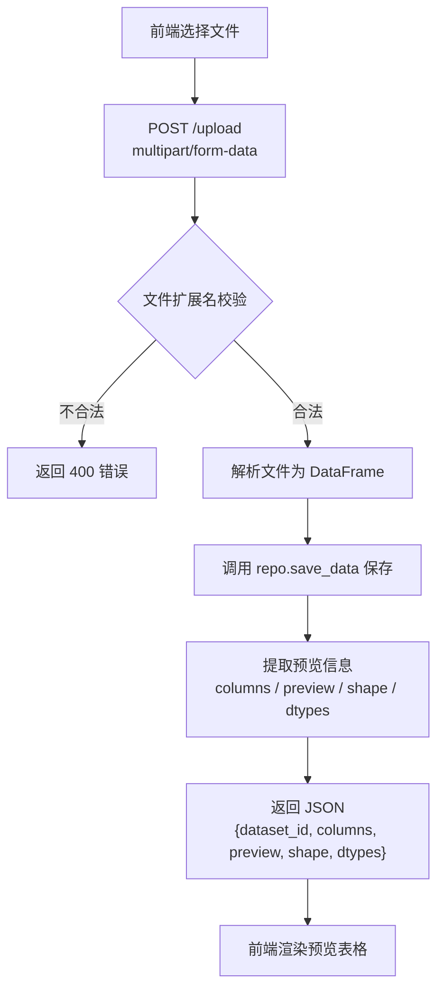
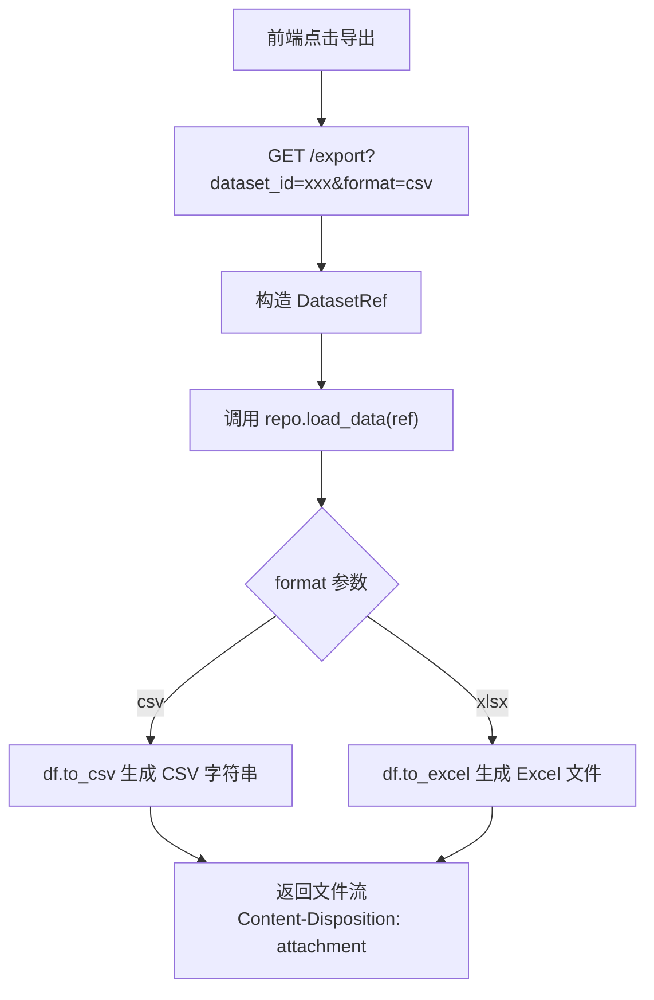

# 数据管理模块 - 开发文档

**负责人**：数据管理模块开发人员

---

## 一、模块概述

数据管理模块负责三个核心功能：
1. **文件上传** - 接收前端上传的 CSV/Excel 文件，解析为 DataFrame，保存并返回预览
2. **数据预览** - 上传后返回列名、前5行数据、行列数、数据类型，供前端展示
3. **数据导出** - 根据数据集引用和指定格式，将数据导出为 CSV 或 Excel 文件流

### 层间定位

```
表示层（前端）
    ↓ HTTP API (/upload, /export)
【控制层】 routes/upload.py, routes/export.py  ← 你在这里实现路由
    ↓ Python 函数调用
【业务层】 services/data_service.py            ← 你在这里实现业务逻辑
    ↓ DataRepository 抽象接口
【数据访问层】 repositories/sqlite_repo.py        ← 项目负责人实现的 SQLite 持久化仓库（当前在用）
```

---

## 二、涉及文件清单

| 文件 | 操作类型 | 说明 |
|------|---------|------|
| `services/data_service.py` | **实现** | 上传文件的解析、保存、预览逻辑 |
| `repositories/file_repo.py` | **参考** | MVP 文件仓库实现（当前未启用，项目使用 SQLiteRepository） |
| `routes/upload.py` | **实现** | `POST /upload` 路由处理 |
| `routes/export.py` | **实现** | `GET /export` 路由处理 |
| `static/js/upload.js` | **实现** | 前端上传和导出的 JS 逻辑 |
| `value_objects.py` | 只读引用 | `DatasetRef` 值对象 |
| `repositories/base.py` | 只读引用 | `DataRepository` 抽象接口 |
| `repositories/sqlite_repo.py` | 只读引用 | SQLite + Parquet 持久化仓库（当前在用） |
| `config.py` | 只读引用 | `ALLOWED_EXTENSIONS`, `UPLOAD_FOLDER` 等配置 |

---

## 三、核心流程

### 3.1 文件上传流程



### 3.2 数据导出流程



---

## 四、详细实现要求

### 4.1 DataService.upload() - 业务逻辑

**文件**: `services/data_service.py`

**方法签名**: `upload(self, file_storage: Any) -> tuple[DatasetRef, dict]`

**实现步骤**:

1. **获取文件名和后缀**
   ```python
   filename = file_storage.filename or "unnamed"
   ext = os.path.splitext(filename)[1].lower()
   ```

2. **校验文件扩展名**
   ```python
   if ext not in config.ALLOWED_EXTENSIONS:
       raise ValueError(f"不支持的文件格式: {ext}")
   ```

3. **解析文件为 DataFrame**

   根据 `ext` 选择解析方式:

   | 扩展名 | 方法 |
   |--------|------|
   | `.csv` | `pd.read_csv(file_storage, encoding=...)` — 注意编码自动检测 |
   | `.xlsx` | `pd.read_excel(file_storage, engine='openpyxl')` |
   | `.xls` | `pd.read_excel(file_storage)` |

   > **编码处理建议**: CSV 文件先读取前 1024 字节，用 `chardet` 检测编码（扩展阶段），或默认尝试 UTF-8 → GBK 回退。

4. **保存并返回预览**
   ```python
   dataset_ref = self.repo.save_data(df)
   preview = {
       "columns": df.columns.tolist(),
       "preview": df.head(5).values.tolist(),
       "shape": list(df.shape),
       "dtypes": {col: str(dtype) for col, dtype in df.dtypes.items()},
   }
   return dataset_ref, preview
   ```

### 4.2 POST /upload 路由

**文件**: `routes/upload.py`

**实现步骤**:

```python
@upload_bp.route("/upload", methods=["POST"])
def upload():
    # 1. 检查文件是否存在
    if "file" not in request.files:
        return jsonify({"status": "error", "message": "未找到上传文件"}), 400

    file = request.files["file"]
    if file.filename == "":
        return jsonify({"status": "error", "message": "文件名为空"}), 400

    # 2. 通过 current_app 获取 service 实例
    data_service = current_app.data_service  # 由 app 工厂注入

    # 3. 调用业务逻辑
    dataset_ref, preview = data_service.upload(file)

    # 4. 返回统一响应
    return jsonify({
        "status": "success",
        "data": {"dataset_id": dataset_ref.id, **preview}
    })
```

> **注意**: 必须捕获 `ValueError` 等异常，返回 `{"status": "error", "message": "..."}` 格式。

### 4.3 GET /export 路由

**文件**: `routes/export.py`

**实现步骤**:

```python
@export_bp.route("/export", methods=["GET"])
def export():
    dataset_id = request.args.get("dataset_id")
    fmt = request.args.get("format", "csv")

    if not dataset_id:
        return jsonify({"status": "error", "message": "缺少 dataset_id"}), 400

    if fmt not in ("csv", "xlsx"):
        return jsonify({"status": "error", "message": f"不支持的导出格式: {fmt}"}), 400

    try:
        ref = DatasetRef(dataset_id)
        data_service = current_app.data_service
        data, content_type, filename = data_service.export_data(ref, fmt)

        return Response(
            data,
            mimetype=content_type,
            headers={"Content-Disposition": f"attachment; filename={filename}"},
        )
    except ValueError as e:
        return jsonify({"status": "error", "message": str(e)}), 400
```

> 关键: 导出接口**不是 JSON 响应**，而是文件流。使用 Flask 的 `send_file` 或直接构造 `Response`:
> - `Content-Type: text/csv` (CSV) / `application/vnd.openxmlformats-officedocument.spreadsheetml.sheet` (xlsx)
> - `Content-Disposition: attachment; filename=xxx.csv`

---

## 五、前端对应代码

**文件**: `static/js/upload.js`

你需要实现以下函数（由 Web 界面开发人员集成到主界面中）：

| 函数 | 说明 |
|------|------|
| `handleUpload(file)` | 上传文件，返回 `{dataset_id, columns, preview, shape, dtypes}` |
| `renderPreview(data)` | 根据上传结果渲染预览表格 |
| `handleExport(datasetId, format)` | 触发出下载 |

### 关键实现提示

```javascript
// upload.js - 上传功能
async function handleUpload(file) {
    const formData = new FormData();
    formData.append("file", file);

    const response = await fetch("/upload", {
        method: "POST",
        body: formData,  // 注意: 上传用 FormData，不用 JSON
    });
    const result = await response.json();
    if (result.status === "error") {
        throw new Error(result.message);
    }
    return result.data;  // { dataset_id, columns, preview, shape, dtypes }
}

// upload.js - 渲染预览
function renderPreview(data) {
    const headerRow = data.columns.map(c => `<th>${c}</th>`).join("");
    document.getElementById("preview-header").innerHTML = `<tr>${headerRow}</tr>`;

    const bodyRows = data.preview.map(row =>
        `<tr>${row.map(cell => `<td>${cell}</td>`).join("")}</tr>`
    ).join("");
    document.getElementById("preview-body").innerHTML = bodyRows;

    // 显示 shape 信息
    document.getElementById("dataset-info").textContent =
        `${data.shape[0]} 行 × ${data.shape[1]} 列`;
}
```

---

## 六、依赖的通用组件

你实现的 `DataService` 使用 `DataRepository` 抽象接口（由项目负责人维护），当前注入的具体实现是 `SQLiteRepository`：

```python
# repositories/base.py — DataRepository 抽象接口
class DataRepository(ABC):
    def save_data(self, df, context=None) -> DatasetRef: ...
    def load_data(self, ref) -> pd.DataFrame: ...
    def delete_data(self, ref) -> None: ...

# DatasetRef 值对象
ref = DatasetRef(id_str)  # 构造引用
ref.id                    # 获取 ID 字符串
```

数据通过 `SQLiteRepository` 以 Parquet BLOB 格式存入 `analysis.db`，重启不丢失。

---

## 七、验收标准

- [ ] 支持 `.csv` 和 `.xlsx` 文件上传
- [ ] CSV 编码兼容 UTF-8 和 GBK
- [ ] 上传后正确显示列名、前5行、行列数
- [ ] 导出 CSV 文件内容与系统内一致
- [ ] 导出 Excel 文件可正常打开
- [ ] 错误场景（无文件、格式不支持、解析失败）返回友好的错误信息

---

## 八、常见问题

**Q: Service 实例从哪里获取？**
A: 在 `app.py` 的 `create_app()` 中会创建 `DataService` 并挂载到 `app.data_service`，路由中通过 `current_app.data_service` 获取。

**Q: upload 中如何获取 Repository？**
A: 直接通过 `self.repo` 访问，`DataService` 构造函数已注入 `DataRepository` 实例。

**Q: 导出的文件命名规则？**
A: 建议使用 `export_{dataset_id前8位}_{时间戳}.csv`。
