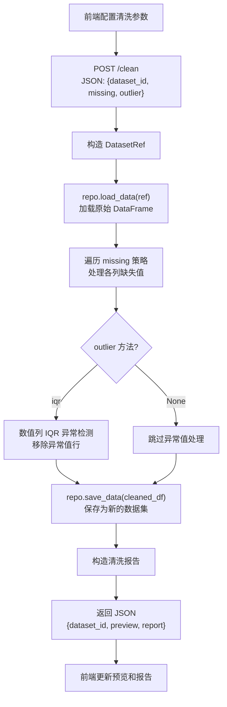
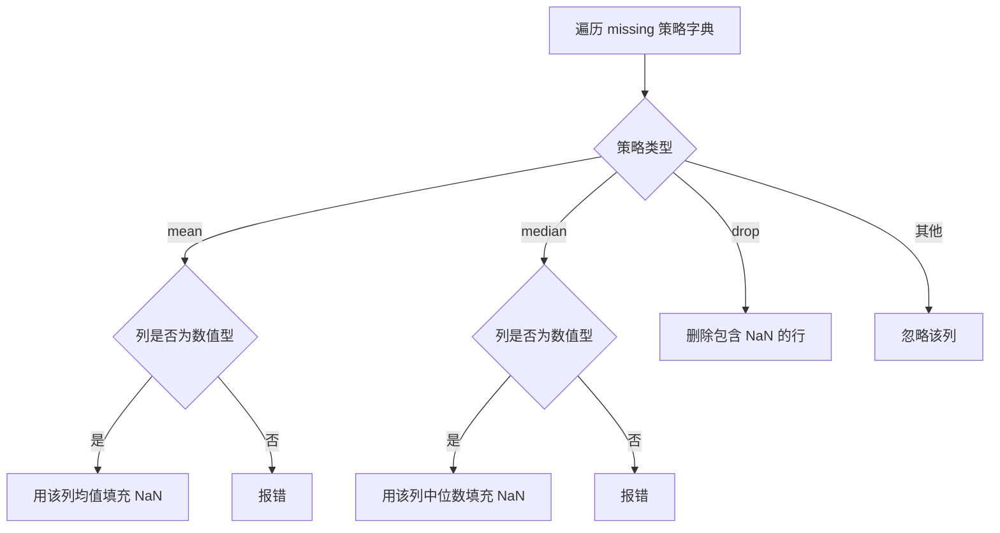
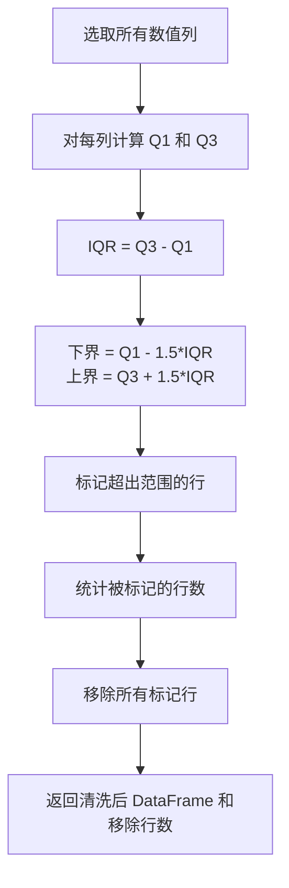

# 数据清洗模块 - 开发文档

**负责人**：数据清洗模块开发人员

---

## 一、模块概述

数据清洗模块负责两个核心功能：
1. **缺失值处理** - 支持均值填充、中位数填充、删除行三种策略，每列可独立配置
2. **异常值检测** - 使用 IQR 方法检测并移除异常值

每次清洗操作生成**新的数据集**，原始数据保持不变（不可变数据操作）。

### 层间定位

```
表示层（前端）
    ↓ HTTP API (/clean)
【控制层】 routes/clean.py                      ← 你在这里实现路由
    ↓ Python 函数调用
【业务层】 services/clean_service.py            ← 你在这里实现业务逻辑
    ↓ DataRepository 抽象接口
【数据访问层】 repositories/sqlite_repo.py        ← 项目负责人实现的 SQLite 持久化仓库
```

---

## 二、涉及文件清单

| 文件 | 操作类型 | 说明 |
|------|---------|------|
| `services/clean_service.py` | **实现** | 清洗核心逻辑：缺失值处理、IQR 异常检测 |
| `routes/clean.py` | **实现** | `POST /clean` 路由处理 |
| `static/js/clean.js` | **实现** | 前端清洗参数配置和请求逻辑 |
| `value_objects.py` | 只读引用 | `DatasetRef` 值对象 |
| `repositories/base.py` | 只读引用 | `DataRepository` 抽象接口 |
| `repositories/sqlite_repo.py` | 只读引用 | SQLite + Parquet 持久化仓库（当前在用） |

---

## 三、核心流程

### 3.1 数据清洗流程



### 3.2 缺失值处理子流程



### 3.3 IQR 异常检测子流程



---

## 四、详细实现要求

### 4.1 CleanService.clean() - 主入口

**文件**: `services/clean_service.py`

**方法签名**: `clean(self, dataset_ref, missing_strategy: dict, outlier_method: str | None) -> tuple[DatasetRef, list, dict]`

**实现步骤**:

```python
def clean(self, dataset_ref, missing_strategy, outlier_method):
    # 1. 加载原始数据
    df = self.repo.load_data(dataset_ref)
    rows_before = len(df)
    report = {}

    # 2. 处理缺失值
    if missing_strategy:
        df, missing_report = self._handle_missing(df, missing_strategy)
        report["missing_handled"] = missing_report

    # 3. 异常值检测
    outliers_removed = 0
    if outlier_method == "iqr":
        df, outliers_removed = self._detect_outliers_iqr(df)

    report["outliers_removed"] = outliers_removed
    report["rows_before"] = rows_before
    report["rows_after"] = len(df)

    # 4. 保存清洗结果为新数据集
    new_ref = self.repo.save_data(df)

    # 5. 构造预览
    preview = df.head(5).values.tolist()

    return new_ref, preview, report
```

### 4.2 _handle_missing() - 缺失值处理

**方法签名**: `_handle_missing(self, df: pd.DataFrame, strategy: dict) -> tuple[pd.DataFrame, dict]`

**策略格式**: `{"列名": "mean" | "median" | "drop"}`

**实现逻辑**:

| 策略 | 实现 | 注意事项 |
|------|------|----------|
| `mean` | `df[col].fillna(df[col].mean(), inplace=True)` | 仅数值列可用，非数值列应报错 |
| `median` | `df[col].fillna(df[col].median(), inplace=True)` | 仅数值列可用 |
| `drop` | `df.dropna(subset=[col], inplace=True)` | 适用于任何类型 |

**报告格式**:
```python
{
    "列A": "均值填充了 5 个缺失值",
    "列B": "删除了 2 个包含缺失值的行"
}
```

### 4.3 _detect_outliers_iqr() - IQR 异常检测

**方法签名**: `_detect_outliers_iqr(self, df: pd.DataFrame) -> tuple[pd.DataFrame, int]`

**实现逻辑**:

```python
def _detect_outliers_iqr(self, df):
    numeric_cols = df.select_dtypes(include=[np.number]).columns
    outlier_mask = pd.Series([False] * len(df))

    for col in numeric_cols:
        Q1 = df[col].quantile(0.25)
        Q3 = df[col].quantile(0.75)
        IQR = Q3 - Q1
        lower = Q1 - 1.5 * IQR
        upper = Q3 + 1.5 * IQR
        outlier_mask |= (df[col] < lower) | (df[col] > upper)

    count = outlier_mask.sum()
    df_clean = df[~outlier_mask].reset_index(drop=True)
    return df_clean, count
```

### 4.4 POST /clean 路由

**文件**: `routes/clean.py`

```python
@clean_bp.route("/clean", methods=["POST"])
def clean():
    params = request.get_json()

    # 校验必填字段
    if "dataset_id" not in params:
        return jsonify({"status": "error", "message": "缺少 dataset_id"}), 400

    dataset_ref = DatasetRef(params["dataset_id"])
    missing = params.get("missing", {})
    outlier = params.get("outlier")

    # 调用 Service
    clean_service = current_app.clean_service
    new_ref, preview, report = clean_service.clean(
        dataset_ref, missing, outlier
    )

    return jsonify({
        "status": "success",
        "data": {
            "dataset_id": new_ref.id,
            "preview": preview,
            "report": report,
            "shape": [report["rows_after"], len(preview[0]) if preview else 0],
        }
    })
```

---

## 五、前端对应代码

**文件**: `static/js/clean.js`

你需要实现：

| 函数 | 说明 |
|------|------|
| `populateCleanOptions(columns)` | 为每列生成缺失值策略下拉框 |
| `collectCleanParams()` | 收集所有列的清洗策略和异常值方法 |
| `handleClean(datasetId)` | 执行清洗并显示结果 |

### 下拉框生成示例

```javascript
function populateCleanOptions(columns) {
    const container = document.getElementById("missing-strategies");
    container.innerHTML = "";

    columns.forEach(col => {
        const div = document.createElement("div");
        div.className = "row mb-2 align-items-center";
        div.innerHTML = `
            <div class="col-3">
                <span class="badge bg-secondary">${col}</span>
            </div>
            <div class="col-9">
                <select class="form-select form-select-sm strategy-select"
                        data-col="${col}">
                    <option value="">不处理</option>
                    <option value="mean">均值填充</option>
                    <option value="median">中位数填充</option>
                    <option value="drop">删除行</option>
                </select>
            </div>
        `;
        container.appendChild(div);
    });
}
```

---

## 六、依赖的通用组件（由数据管理模块实现，你只需了解接口）

```python
repo.save_data(df)        # → DatasetRef
repo.load_data(ref)       # → DataFrame
DatasetRef(id_str)        # 构造引用
```

---

## 七、验收标准

- [ ] 均值填充正确计算该列均值并填充 NaN
- [ ] 中位数填充正确计算中位数并填充 NaN
- [ ] 删除行策略正确删除包含 NaN 的行
- [ ] 非数值列使用 mean/median 时报错而非静默失败
- [ ] IQR 正确计算 Q1/Q3/IQR 并移除异常值行
- [ ] 清洗报告准确反映处理情况（填充数量、移除数量）
- [ ] 原始数据集不受清洗操作影响（不可变）

---

## 八、常见问题

**Q: 均值填充时，如果某列全为 NaN 怎么办？**
A: 均值不存在，应报错提示"列 X 全为缺失值，无法计算均值"。

**Q: IQR 检测是否必须对所有列执行？**
A: 只对数值列执行。非数值列（字符串、日期等）应自动跳过。

**Q: 清洗后为什么返回新的 dataset_id？**
A: 每次清洗生成新的数据集，实现不可变数据。前端需要用新的 dataset_id 进行后续操作。
