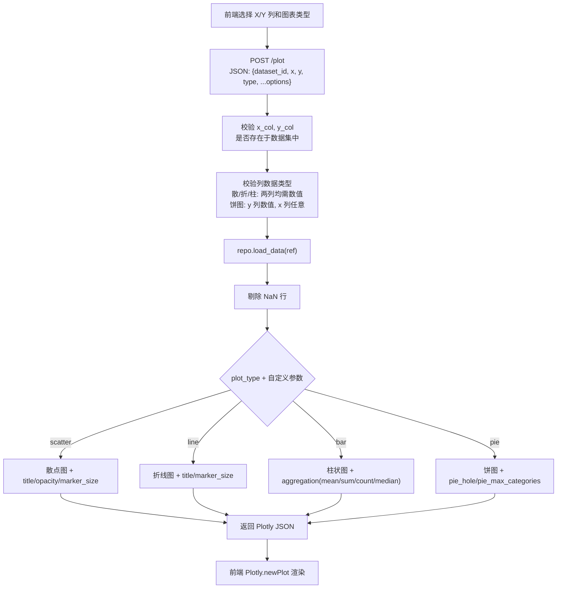

# 可视化模块 - 开发文档

**负责人**：可视化模块开发人员

---

## 一、模块概述

可视化模块负责根据用户选择的数据列和图表类型，生成散点图、折线图、柱状图、饼图四种交互式图表。

**技术选型**：Plotly（交互式图表，支持缩放、悬停提示、截图）

**已实现功能**：
- 四种图表类型：散点图 / 折线图 / 柱状图 / 饼图
- 自定义参数透传：标题、配色、透明度、标记大小、聚合方式、饼图空心比例
- 后端所有配置均有默认值，前端不传参数时自动使用默认值

### 层间定位

```
表示层（前端）
    ↓ HTTP API (/plot)
【控制层】 routes/plot.py                        ← 你在这里实现路由
    ↓ Python 函数调用
【业务层】 services/visualize_service.py         ← 你在这里实现业务逻辑
    ↓ DataRepository 抽象接口
【数据访问层】 repositories/sqlite_repo.py       ← 项目负责人实现的 SQLite 持久化仓库
```

---

## 二、涉及文件清单

| 文件 | 操作类型 | 说明 |
|------|---------|------|
| `services/visualize_service.py` | **实现** | 图表生成核心逻辑 |
| `routes/plot.py` | **实现** | `POST /plot` 路由处理 |
| `static/js/plot.js` | **实现** | 前端图表交互逻辑 |
| `templates/index.html` | 修改 | 添加 Plotly.js CDN（如果用 Plotly）和图表容器 |
| `value_objects.py` | 只读引用 | `DatasetRef` |
| `repositories/base.py` | 只读引用 | `DataRepository` 抽象接口 |

---

## 三、核心流程

### 3.1 图表生成流程



---

## 四、详细实现要求

### 4.1 VisualizeService.generate_plot() - 核心方法

**文件**: `services/visualize_service.py`

**方法签名**: `generate_plot(self, dataset_ref: DatasetRef, x_col: str, y_col: str, plot_type: str, **options) -> dict`

**实现步骤**:

```python
def generate_plot(self, dataset_ref, x_col, y_col, plot_type, **options):
    # 1. 加载数据
    df = self.repo.load_data(dataset_ref)

    # 2. 校验列是否存在
    if x_col not in df.columns:
        raise ValueError(f"列 '{x_col}' 不存在")
    if y_col not in df.columns:
        raise ValueError(f"列 '{y_col}' 不存在")

    # 3. 根据图表类型校验数据类型
    if plot_type == "pie":
        # 饼图：y 列必须为数值，x 列可以是分类
        if not pd.api.types.is_numeric_dtype(df[y_col]):
            raise ValueError(f"Y 列 '{y_col}' 必须是数值类型")
    else:
        # 散/折/柱：两列都必须是数值
        if not pd.api.types.is_numeric_dtype(df[x_col]):
            raise ValueError(f"X 列 '{x_col}' 必须是数值类型")
        if not pd.api.types.is_numeric_dtype(df[y_col]):
            raise ValueError(f"Y 列 '{y_col}' 必须是数值类型")

    # 4. 剔除 NaN 行
    plot_df = df[[x_col, y_col]].dropna()

    # 5. 根据 plot_type 分发，透传自定义参数
    if plot_type == "scatter":
        return self._scatter(plot_df, x_col, y_col, **options)
    elif plot_type == "line":
        return self._line(plot_df, x_col, y_col, **options)
    elif plot_type == "bar":
        return self._bar(plot_df, x_col, y_col, **options)
    elif plot_type == "pie":
        return self._pie(plot_df, x_col, y_col, **options)
    else:
        raise ValueError(f"不支持的图表类型: {plot_type}")
```

### 4.2 Plotly 实现（当前方案）

**最终选型**：Plotly（交互式图表），返回 `plotly_json` 供前端 `Plotly.newPlot()` 渲染。

**自定义参数**：所有方法通过 `**options` 接受可选样式参数：

| 参数 | 类型 | 默认值 | 适用图表 |
|------|------|--------|---------|
| `title` | str | 自动生成 | 全部 |
| `color_scheme` | list | `px.colors.qualitative.D3` | 全部 |
| `opacity` | float | 0.8 | scatter |
| `marker_size` | int | 12(scatter) / 10(line) | scatter, line |
| `aggregation` | str | "mean" | bar |
| `pie_hole` | float | 0.3 | pie |
| `pie_max_categories` | int | 10 | pie |

```python
import plotly.graph_objects as go
import plotly.express as px


def _scatter(self, df, x_col, y_col, **options):
    color_seq = options.get("color_scheme", px.colors.qualitative.D3)
    fig = px.scatter(
        df, x=x_col, y=y_col,
        title=options.get("title") or f"{x_col} vs {y_col} 散点图",
        color_discrete_sequence=[color_seq[0]] if isinstance(color_seq, list) else [color_seq],
        opacity=options.get("opacity", 0.8)
    )
    fig.update_traces(marker=dict(size=options.get("marker_size", 12)))
    return {"plotly_json": fig.to_json()}


def _line(self, df, x_col, y_col, **options):
    sorted_df = df.sort_values(by=x_col)
    fig = px.line(
        sorted_df, x=x_col, y=y_col, markers=True,
        title=options.get("title") or f"{x_col} vs {y_col} 折线图",
    )
    fig.update_traces(marker=dict(size=options.get("marker_size", 10)))
    return {"plotly_json": fig.to_json()}


def _bar(self, df, x_col, y_col, **options):
    aggregation = options.get("aggregation", "mean")
    if aggregation == "mean":
        grouped = df.groupby(x_col)[y_col].mean().reset_index()
    elif aggregation == "sum":
        grouped = df.groupby(x_col)[y_col].sum().reset_index()
    # ... 还支持 count, median
    fig = px.bar(grouped, x=x_col, y=y_col,
                 title=options.get("title") or f"{x_col} vs {y_col} 柱状图")
    return {"plotly_json": fig.to_json()}


def _pie(self, df, x_col, y_col, **options):
    max_cat = options.get("pie_max_categories", 10)
    grouped = df.groupby(x_col)[y_col].sum().reset_index()
    if len(grouped) > max_cat:
        # 超出部分归为"其他"
        ...
    fig = px.pie(grouped, values=y_col, names=x_col,
                 title=options.get("title") or f"{y_col} 按 {x_col} 分布",
                 hole=options.get("pie_hole", 0.3))
    return {"plotly_json": fig.to_json()}
```

### 4.4 POST /plot 路由

**文件**: `routes/plot.py`

```python
@plot_bp.route("/plot", methods=["POST"])
def plot():
    params = request.get_json()

    # 校验必填字段
    required = ["dataset_id", "x", "y", "type"]
    for field in required:
        if field not in params:
            return jsonify({"status": "error", "message": f"缺少参数: {field}"}), 400

    dataset_ref = DatasetRef(params["dataset_id"])
    visualize_service = current_app.visualize_service

    # 提取额外自定义参数（除必填字段外的所有字段，透传给 Service）
    extra = {k: v for k, v in params.items() if k not in required}

    result = visualize_service.generate_plot(
        dataset_ref, params["x"], params["y"], params["type"], **extra
    )

    return jsonify({"status": "success", "data": result})
```

> **关键**：`extra` 字典收集了请求体中除 4 个必填字段外的所有参数（如 title, opacity, aggregation 等），透传给 `generate_plot` 的 `**options`。

---

## 五、前端对应代码

**文件**: `static/js/plot.js`

```javascript
// plot.js - 可视化模块前端逻辑

async function handlePlot(datasetId) {
    const x = document.getElementById("plot-x").value;
    const y = document.getElementById("plot-y").value;
    const type = document.getElementById("plot-type").value;

    const response = await fetch("/plot", {
        method: "POST",
        headers: { "Content-Type": "application/json" },
        body: JSON.stringify({
            dataset_id: datasetId,
            x: x, y: y, type: type,
            // 可附加自定义参数: title, opacity, aggregation, etc.
        }),
    });
    const result = await response.json();

    if (result.status === "error") {
        showError("生成图表失败: " + result.message);
        return null;
    }

    // Plotly 渲染
    const container = document.getElementById("plot-container");
    container.style.display = "block";
    const chartDiv = document.getElementById("plotly-chart");
    Plotly.newPlot(chartDiv, JSON.parse(result.data.plotly_json));
    return result.data;
}
```

> **注意**：当前仅支持 Plotly 模式。前端引入 `plotly-2.32.0.min.js` CDN，通过 `Plotly.newPlot()` 渲染。

---

## 六、验收标准

- [x] 散点图正确显示 X/Y 轴的数值分布（Plotly 交互式）
- [x] 折线图按 X 轴排序后正确绘制（含面积填充）
- [x] 柱状图对 X 轴分组聚合，支持 mean/sum/count/median 四种聚合
- [x] 饼图正确生成，支持空心比例和分类数限制
- [x] 图表包含坐标轴标签和标题
- [x] 选中非数值列时报错，不能静默失败
- [x] 图表中的 NaN 行被正确处理（剔除而非报错）
- [x] 自定义参数通过 `**options` 透传，不传则全部走默认值
- [x] 返回 Plotly JSON 而非 base64 图片，前端交互式渲染

---

## 七、常见问题

**Q: Plotly 和 Matplotlib 怎么选的？**
A: 最终选择了 Plotly。Plotly 生成交互式图表（缩放、悬停提示、截图），前端使用 Plotly.js 渲染。已在 `requirements.txt` 中添加 `plotly>=5`。

**Q: `**options` 参数的设计意图？**
A: 新增自定义参数时不需要修改方法签名，只需在对应图表方法中用 `options.get("key", default)` 读取即可。前端不传参时全部走默认值，完全向后兼容。

**Q: 为什么饼图的校验逻辑和其他图表不同？**
A: 饼图需要用分类列（非数值）作为扇区标签，数值列决定扇区大小。所以饼图只校验 y 列为数值，x 列可以是任意类型。
