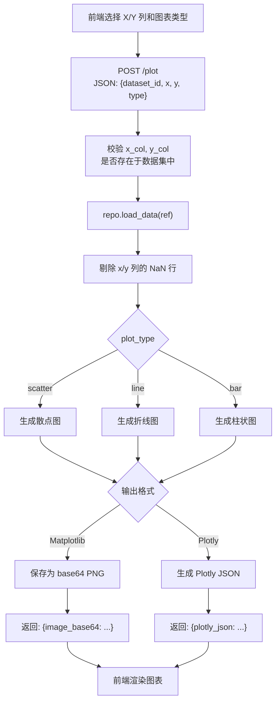

# 可视化模块 - 开发文档

**负责人**：可视化模块开发人员

---

## 一、模块概述

可视化模块负责根据用户选择的数据列和图表类型，生成散点图、折线图、柱状图。

**技术选型（二选一）**：

| 方案 | 返回格式 | 前端渲染方式 | 优势 |
|------|---------|-------------|------|
| Matplotlib | base64 编码的 PNG 图片 | `` | 简单直接 |
| Plotly | Plotly Figure JSON | Plotly.js 库渲染 | 交互式（缩放、悬停提示） |

> **建议**: MVP 阶段使用 Matplotlib 方案，开发更快。扩展阶段可升级到 Plotly。

### 层间定位

```
表示层（前端）
    ↓ HTTP API (/plot)
【控制层】 routes/plot.py                        ← 你在这里实现路由
    ↓ Python 函数调用
【业务层】 services/visualize_service.py         ← 你在这里实现业务逻辑
    ↓ DataRepository 抽象接口
【数据访问层】 repositories/file_repo.py         ← 数据管理模块实现，你只通过接口调用
```

---

## 二、涉及文件清单

| 文件 | 操作类型 | 说明 |
|------|---------|------|
| `services/visualize_service.py` | **实现** | 图表生成核心逻辑 |
| `routes/plot.py` | **实现** | `POST /plot` 路由处理 |
| `static/js/plot.js` | **实现** | 前端图表交互逻辑 |
| `templates/index.html` | 修改 | 添加 Plotly.js CDN（如果用 Plotly）和图表容器 |
| `value_objects.py` | 只读引用 | `DatasetRef` |
| `repositories/base.py` | 只读引用 | `DataRepository` 抽象接口 |

---

## 三、核心流程

### 3.1 图表生成流程



### 3.2 Matplotlib 模式下 base64 生成流程


---

## 四、详细实现要求

### 4.1 VisualizeService.generate_plot() - 核心方法

**文件**: `services/visualize_service.py`

**方法签名**: `generate_plot(self, dataset_ref: DatasetRef, x_col: str, y_col: str, plot_type: str) -> dict`

**实现步骤**:

```python
def generate_plot(self, dataset_ref, x_col, y_col, plot_type):
    # 1. 加载数据
    df = self.repo.load_data(dataset_ref)

    # 2. 校验列是否存在
    if x_col not in df.columns:
        raise ValueError(f"列 '{x_col}' 不存在")
    if y_col not in df.columns:
        raise ValueError(f"列 '{y_col}' 不存在")

    # 3. 检查是否为数值列
    if not pd.api.types.is_numeric_dtype(df[x_col]):
        raise ValueError(f"X 列 '{x_col}' 不是数值类型")
    if not pd.api.types.is_numeric_dtype(df[y_col]):
        raise ValueError(f"Y 列 '{y_col}' 不是数值类型")

    # 4. 剔除 NaN 行
    plot_df = df[[x_col, y_col]].dropna()

    # 5. 根据 plot_type 分发
    if plot_type == "scatter":
        return self._scatter_plot(plot_df, x_col, y_col)
    elif plot_type == "line":
        return self._line_plot(plot_df, x_col, y_col)
    elif plot_type == "bar":
        return self._bar_plot(plot_df, x_col, y_col)
    else:
        raise ValueError(f"不支持的图表类型: {plot_type}")
```

### 4.2 Matplotlib 方案实现

```python
import matplotlib
matplotlib.use("Agg")  # 非交互式后端，必须在导入 pyplot 之前设置

import matplotlib.pyplot as plt
import base64
from io import BytesIO


def _scatter_plot(self, df, x_col, y_col):
    fig, ax = plt.subplots(figsize=(8, 5))
    ax.scatter(df[x_col], df[y_col], alpha=0.6)
    ax.set_xlabel(x_col)
    ax.set_ylabel(y_col)
    ax.set_title(f"{x_col} vs {y_col} 散点图")
    ax.grid(True, alpha=0.3)

    return self._fig_to_base64(fig)


def _line_plot(self, df, x_col, y_col):
    fig, ax = plt.subplots(figsize=(8, 5))
    # 注意: 折线图通常按 x 排序
    sorted_df = df.sort_values(x_col)
    ax.plot(sorted_df[x_col], sorted_df[y_col], marker="o", linewidth=1.5)
    ax.set_xlabel(x_col)
    ax.set_ylabel(y_col)
    ax.set_title(f"{x_col} vs {y_col} 折线图")
    ax.grid(True, alpha=0.3)

    return self._fig_to_base64(fig)


def _bar_plot(self, df, x_col, y_col):
    fig, ax = plt.subplots(figsize=(8, 5))
    # 对 x 分组，显示 y 的均值（或总和）
    grouped = df.groupby(x_col)[y_col].mean().reset_index()
    ax.bar(grouped[x_col].astype(str), grouped[y_col])
    ax.set_xlabel(x_col)
    ax.set_ylabel(y_col)
    ax.set_title(f"{x_col} vs {y_col} 柱状图")
    ax.tick_params(axis="x", rotation=45)
    ax.grid(True, alpha=0.3)

    return self._fig_to_base64(fig)


def _fig_to_base64(self, fig):
    buf = BytesIO()
    fig.savefig(buf, format="png", dpi=100, bbox_inches="tight")
    plt.close(fig)
    buf.seek(0)
    img_base64 = base64.b64encode(buf.read()).decode("utf-8")
    return {"image_base64": img_base64}
```

### 4.3 Plotly 方案实现（可选）

```python
import plotly.express as px
import json


def _scatter_plot_plotly(self, df, x_col, y_col):
    fig = px.scatter(df, x=x_col, y=y_col, title=f"{x_col} vs {y_col} 散点图")
    return {"plotly_json": json.loads(fig.to_json())}
```

### 4.4 POST /plot 路由

**文件**: `routes/plot.py`

```python
@plot_bp.route("/plot", methods=["POST"])
def plot():
    params = request.get_json()

    # 校验必填字段
    required = ["dataset_id", "x", "y", "type"]
    for field in required:
        if field not in params:
            return jsonify({"status": "error", "message": f"缺少参数: {field}"}), 400

    dataset_ref = DatasetRef(params["dataset_id"])
    visualize_service = current_app.visualize_service

    result = visualize_service.generate_plot(
        dataset_ref, params["x"], params["y"], params["type"]
    )

    return jsonify({"status": "success", "data": result})
```

---

## 五、前端对应代码

**文件**: `static/js/plot.js`

```javascript
// plot.js - 可视化模块前端逻辑

async function handlePlot(datasetId) {
    const x = document.getElementById("plot-x").value;
    const y = document.getElementById("plot-y").value;
    const type = document.getElementById("plot-type").value;

    const result = await postJSON("/plot", {
        dataset_id: datasetId,
        x: x,
        y: y,
        type: type,
    });

    if (result.status === "error") {
        alert("生成图表失败: " + result.message);
        return;
    }

    const container = document.getElementById("plot-container");
    container.style.display = "block";

    // Matplotlib 模式
    if (result.data.image_base64) {
        container.innerHTML = ``;
    }
    // Plotly 模式
    else if (result.data.plotly_json) {
        container.innerHTML = `<div id="plotly-chart"></div>`;
        Plotly.newPlot("plotly-chart", result.data.plotly_json);
    }
}
```

---

## 六、验收标准

- [ ] 散点图正确显示 X/Y 轴的数值分布
- [ ] 折线图按 X 轴排序后正确绘制
- [ ] 柱状图对 X 轴分组聚合后显示均值/总数
- [ ] 图表包含坐标轴标签和标题
- [ ] 选中非数值列时报错，不能静默失败
- [ ] 图表中的 NaN 行被正确处理（剔除而非报错）

---

## 七、常见问题

**Q: Matplotlib 的中文乱码怎么处理？**
A: 建议添加 `plt.rcParams['font.sans-serif'] = ['SimHei', 'DejaVu Sans']`，或在图表中使用英文标签。

**Q: 如果 X 列有大量重复值，柱状图会很拥挤怎么办？**
A: MVP 阶段保持简单，如果有能力可以添加 `tick_params(rotation=45)` 旋转标签。

**Q: Matplotlib 的 `Agg` 后端有什么用？**
A: Flask 服务端没有 GUI 显示，使用 `Agg` 后端可以避免弹出图形窗口，直接将图表渲染到内存缓冲区。
