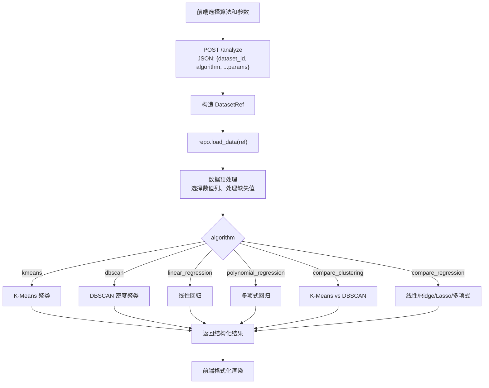
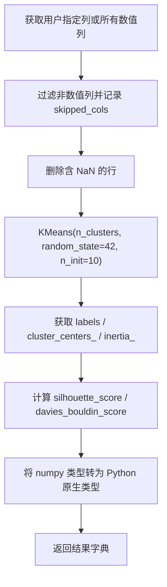
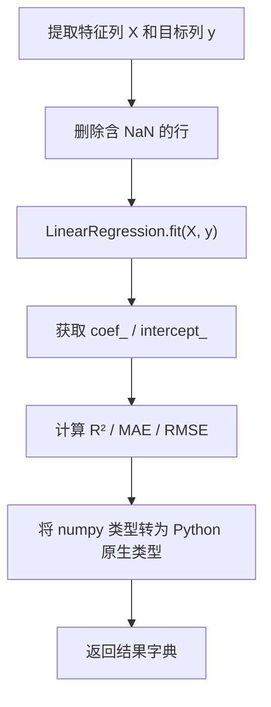
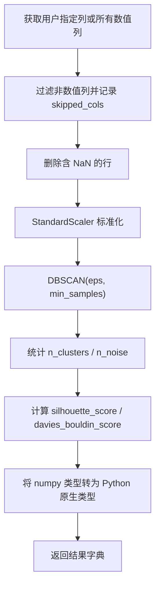

# 分析功能模块 - 开发文档

**负责人**：分析功能模块开发人员

---

## 一、模块概述

分析功能模块提供机器学习分析能力。已实现以下 6 种算法：

1. **K-Means 聚类** — 对数据进行聚类，返回聚类标签、中心点和评估指标
2. **DBSCAN 密度聚类** — 基于密度的聚类，自动发现簇数量，识别噪声点
3. **线性回归** — 支持多特征列的线性回归，返回系数和评估指标
4. **多项式回归** — 单特征多项式拟合，阶数 2~5 可调
5. **聚类对比** — 同时运行 K-Means 和 DBSCAN，对比结果
6. **回归对比** — 同时运行线性 / Ridge / Lasso / 多项式回归，对比 R²/MAE/RMSE

### 算法选择建议

| 算法 | 适用数据 | 输出 |
|------|---------|------|
| K-Means | 无标签的数值数据 | 聚类标签、中心点、惯性、轮廓系数、DB 指数 |
| DBSCAN | 无标签的数值数据（含噪声容忍） | 聚类标签、簇数量、噪声点、轮廓系数 |
| 线性回归 | 有特征和目标列的数值数据 | 系数、截距、R²、MAE、RMSE |
| 多项式回归 | 单特征非线性关系 | 多项式系数、R²、MAE、RMSE |
| 聚类对比 | 同上（评估多种聚类算法） | 对比表格，含所有指标 |
| 回归对比 | 同上（评估多种回归算法） | 对比表格，自动标注最优 R² |

> **状态**：✅ 已实现。后端 `AnalyzeService` + 路由 + 前端 JS 均已完成。

### 层间定位

```
表示层（前端）
    ↓ HTTP API (/analyze)
【控制层】 routes/analyze.py                     ← 接收请求，调用 Service
    ↓ Python 函数调用
【业务层】 services/analyze_service.py           ← 分析核心算法
    ↓ DataRepository 抽象接口
【数据访问层】 repositories/sqlite_repo.py       ← SQLite 持久化
```

---

## 二、涉及文件清单

| 文件 | 操作类型 | 说明 |
|------|---------|------|
| `services/analyze_service.py` | **已实现** | 分析核心逻辑：K-Means/DBSCAN/线性回归/多项式回归/对比 |
| `routes/analyze.py` | **已实现** | `POST /analyze` 统一分发 + 6 条独立路由 |
| `static/js/analyze.js` | **已实现** | 前端分析参数配置、结果格式化渲染、独立 runner 函数 |
| `value_objects.py` | 只读引用 | `DatasetRef` |
| `repositories/base.py` | 只读引用 | `DataRepository` 抽象接口 |

---

## 三、核心流程

### 3.1 分析总流程



### 3.2 K-Means 聚类子流程



### 3.3 线性回归子流程



### 3.4 DBSCAN 密度聚类子流程



---

## 四、详细实现要求

### 4.1 AnalyzeService.analyze() - 统一分发入口

**文件**: `services/analyze_service.py`

**方法签名**: `analyze(self, dataset_ref: DatasetRef, algorithm: str, params: dict) -> dict`

**实现步骤**:

```python
def analyze(self, dataset_ref, algorithm, params):
    # 1. 加载数据
    df = self._load_data(dataset_ref)

    # 2. dict 分发（比 if/elif 更易扩展）
    dispatch = {
        "kmeans": self._kmeans_analysis,
        "dbscan": self._dbscan_analysis,
        "linear_regression": self._linear_regression_analysis,
        "polynomial_regression": self._polynomial_regression_analysis,
        "compare_clustering": self._compare_clustering_analysis,
        "compare_regression": self._compare_regression_analysis,
    }
    handler = dispatch.get(algorithm)
    if handler is None:
        raise ValueError(f"不支持的算法: {algorithm}")

    return handler(df, params)
```

### 4.2 K-Means 聚类实现

```python
from sklearn.cluster import KMeans
from sklearn.metrics import silhouette_score, davies_bouldin_score


def _kmeans_analysis(self, df: pd.DataFrame, params: dict) -> dict:
    # 参数
    columns = params.get("columns") or [
        c for c in df.columns if pd.api.types.is_numeric_dtype(df[c])
    ]
    n_clusters = params.get("n_clusters", 3)

    # 校验
    if len(columns) < 1:
        raise ValueError("至少需要选择一列")
    if not (2 <= n_clusters <= 10):
        raise ValueError("K 值应在 2~10 之间")

    # 数据预处理：选择数值列，记录被跳过的列，删除 NaN
    numeric_cols = [c for c in columns if pd.api.types.is_numeric_dtype(df[c])]
    skipped_cols = [c for c in columns if c not in numeric_cols]
    if not numeric_cols:
        raise ValueError("所选列中不含任何数值列，无法聚类")

    data = df[numeric_cols].dropna()
    if len(data) < n_clusters:
        raise ValueError("数据行数不能少于 K 值")

    # 执行聚类
    # 可选：先标准化 data = StandardScaler().fit_transform(data)
    model = KMeans(n_clusters=n_clusters, random_state=42, n_init=10)
    labels = model.fit_predict(data)

    # 评估指标（至少两个簇时计算）
    sil_score = None
    db_score = None
    if len(set(labels)) > 1:
        sil_score = round(float(silhouette_score(data, labels)), 4)
        db_score = round(float(davies_bouldin_score(data, labels)), 4)

    return {
        "labels": labels.tolist(),                        # list[int]
        "centers": model.cluster_centers_.tolist(),        # list[list[float]]
        "n_clusters": n_clusters,                          # int
        "columns": numeric_cols,                           # list[str]
        "skipped_cols": skipped_cols,                      # list[str]
        "data": data.values.tolist(),                      # list[list]
        "inertia": round(float(model.inertia_), 4),        # float
        "silhouette_score": sil_score,                     # float | None
        "davies_bouldin_score": db_score,                  # float | None
    }
```

### 4.3 线性回归实现

```python
from sklearn.linear_model import LinearRegression
from sklearn.metrics import r2_score, mean_absolute_error, mean_squared_error


def _linear_regression_analysis(self, df: pd.DataFrame, params: dict) -> dict:
    feature_cols = params.get("feature_cols", [])
    target_col = params.get("target_col", "")

    # 校验
    if not feature_cols:
        raise ValueError("至少需要选择一个特征列")
    if not target_col:
        raise ValueError("需要指定目标列")

    # 提取特征和目标，删除 NaN
    data = df[feature_cols + [target_col]].dropna()
    if len(data) < 2:
        raise ValueError("有效数据行数不足，无法回归")

    X = data[feature_cols].values
    y = data[target_col].values

    # 执行回归
    model = LinearRegression()
    model.fit(X, y)
    y_pred = model.predict(X)

    return {
        "coefficients": [round(float(c), 6) for c in model.coef_],  # list[float]
        "intercept": round(float(model.intercept_), 6),              # float
        "r_squared": round(float(r2_score(y, y_pred)), 6),          # float
        "r2_score": round(float(r2_score(y, y_pred)), 6),           # float（兼容）
        "mae": round(float(mean_absolute_error(y, y_pred)), 6),     # float
        "rmse": round(float(np.sqrt(mean_squared_error(y, y_pred))), 6),  # float
        "slope": coefficients[0] if 单特征 else None,               # float | None
        "y_predicted": [round(v, 4) for v in y_pred.tolist()],     # list[float]
        "feature_cols": feature_cols,                               # list[str]
        "target_col": target_col,                                   # str
    }
```

### 4.4 POST /analyze 统一分发路由

**文件**: `routes/analyze.py`

```python
@analyze_bp.route("/analyze", methods=["POST"])
@handle_errors
def analyze_dispatch():
    body = request.get_json(force=True)
    _validate_body(body, ["dataset_id", "algorithm"])

    dataset_ref = DatasetRef(body["dataset_id"])
    algorithm = body.pop("algorithm")  # 从 body 中移除 algorithm

    service = current_app.analyze_service
    result = service.analyze(dataset_ref, algorithm, body)  # body 剩余字段作为 params

    return jsonify({"status": "success", "data": result})
```

> **注意**: `body.pop("algorithm")` 后，`body` 中剩余的字段（如 `n_clusters`、`feature_cols`、`target_col` 等）直接传入 `analyze()` 作为算法参数。

路由异常处理由 `@handle_errors` 装饰器统一处理：

| 异常 | HTTP 状态码 |
|------|------------|
| `KeyError` / `TypeError` | 400 |
| `ValueError` | 422 |
| `FileNotFoundError` | 404 |
| 其他 `Exception` | 500 |

### 4.5 DBSCAN 密度聚类实现

```python
from sklearn.cluster import DBSCAN
from sklearn.preprocessing import StandardScaler


def _dbscan_analysis(self, df: pd.DataFrame, params: dict) -> dict:
    columns = params.get("columns") or [
        c for c in df.columns if pd.api.types.is_numeric_dtype(df[c])
    ]
    eps = params.get("eps", 0.5)
    min_samples = params.get("min_samples", 5)

    # 校验
    if not columns:
        raise ValueError("至少需要选择一列")
    if eps <= 0:
        raise ValueError("eps 必须大于 0")
    if min_samples < 1:
        raise ValueError("min_samples 至少为 1")

    # 数据预处理
    numeric_cols = [c for c in columns if pd.api.types.is_numeric_dtype(df[c])]
    skipped_cols = [c for c in columns if c not in numeric_cols]
    data = df[numeric_cols].dropna()

    # 标准化（密度聚类对尺度敏感）
    scaler = StandardScaler()
    data_scaled = scaler.fit_transform(data)

    # 执行聚类
    model = DBSCAN(eps=eps, min_samples=min_samples)
    labels = model.fit_predict(data_scaled)

    # 统计
    n_clusters = len(set(labels)) - (1 if -1 in labels else 0)
    n_noise = int(np.sum(labels == -1))

    # 评估指标
    ...

    return {
        "labels": labels.tolist(),
        "n_clusters": n_clusters,
        "n_noise": n_noise,
        "silhouette_score": sil_score,
        "davies_bouldin_score": db_score,
        "eps": eps,
        "min_samples": min_samples,
        ...
    }
```

### 4.6 多项式回归实现

```python
from sklearn.preprocessing import PolynomialFeatures
from sklearn.pipeline import make_pipeline


def _polynomial_regression_analysis(self, df: pd.DataFrame, params: dict) -> dict:
    feature_col = params.get("feature_col", "")
    target_col = params.get("target_col", "")
    degree = params.get("degree", 2)

    # 校验
    if not feature_col or not target_col:
        raise ValueError("需要指定特征列和目标列")
    if not (2 <= degree <= 5):
        raise ValueError("多项式阶数应在 2~5 之间")

    # 数据准备
    data = df[[feature_col, target_col]].dropna()
    if len(data) < degree + 1:
        raise ValueError("有效数据行数不足")

    X = data[[feature_col]].values
    y = data[target_col].values

    # 执行回归（Pipeline: 多项式特征 + 线性回归）
    model = make_pipeline(
        PolynomialFeatures(degree=degree, include_bias=False),
        LinearRegression(),
    )
    model.fit(X, y)
    y_pred = model.predict(X)

    return {
        "degree": degree,
        "coefficients": [round(float(c), 6) for c in lr_step.coef_],
        "intercept": round(float(lr_step.intercept_), 6),
        "r2_score": round(float(r2_score(y, y_pred)), 6),
        "mae": round(float(mean_absolute_error(y, y_pred)), 6),
        "rmse": round(float(np.sqrt(mean_squared_error(y, y_pred))), 6),
        "feature_col": feature_col,
        "target_col": target_col,
    }
```

### 4.7 算法对比

#### 聚类对比

```python
def _compare_clustering_analysis(self, df: pd.DataFrame, params: dict) -> dict:
    # params 直接透传给 kmeans 和 dbscan 的内部方法
    results = {}
    errors = {}
    try:
        results["kmeans"] = self._kmeans_analysis(df, params)
    except Exception as e:
        errors["kmeans"] = str(e)
    try:
        results["dbscan"] = self._dbscan_analysis(df, params)
    except Exception as e:
        errors["dbscan"] = str(e)
    if not results:
        raise ValueError("所有算法均运行失败")

    summary = [
        {"算法": "K-Means", "发现簇数": ..., "轮廓系数 ↑": ..., "DB 指数 ↓": ..., "Inertia ↓": ...},
        {"算法": "DBSCAN", "发现簇数": ..., "噪声点数": ..., "轮廓系数 ↑": ..., "DB 指数 ↓": ...},
    ]
    return {"results": results, "summary": summary, "errors": errors}
```

#### 回归对比

同时运行线性回归 / Ridge / Lasso / 多项式回归，计算 R² / MAE / RMSE 并汇总至对比表格。

```python
def _compare_regression_analysis(self, df: pd.DataFrame, params: dict) -> dict:
    # 线性模型
    linear_algos = {
        "线性回归": LinearRegression(),
        "Ridge 回归": Ridge(alpha=1.0),
        "Lasso 回归": Lasso(alpha=0.1, max_iter=10000),
    }
    # 拟合 → 计算指标 → 汇总 summary
    # 自动标注 R² 最优算法
    # 多项式回归单独处理（使用 feature_cols[0] 单特征）
    ...
    return {"results": results, "summary": summary, ...}
```

### 4.8 按算法独立路由

除统一分发路由外，保留 6 条独立路由供前端兼容：

| 路由 | 对应 Service 方法 |
|------|-----------------|
| `POST /analyze/kmeans` | `service.kmeans(dataset_ref, columns, n_clusters)` |
| `POST /analyze/dbscan` | `service.dbscan(dataset_ref, columns, eps, min_samples)` |
| `POST /analyze/regression` | `service.linear_regression(dataset_ref, feature_cols, target_col)` |
| `POST /analyze/poly_regression` | `service.polynomial_regression(dataset_ref, feature_col, target_col, degree)` |
| `POST /analyze/compare/clustering` | `service.compare_clustering(dataset_ref, columns, n_clusters, eps, min_samples)` |
| `POST /analyze/compare/regression` | `service.compare_regression(dataset_ref, feature_cols, target_col, degree)` |

独立路由走 `@handle_errors` 异常处理，参数展开，类型安全，与统一路由共享同一 Service 实例。

---

## 五、前端对应代码

**文件**: `static/js/analyze.js`

### `populateAlgorithmParams(algorithm, columns)`

```javascript
function populateAlgorithmParams(algorithm, columns) {
    _currentColumns = columns || [];  // 保存列名供后续使用

    if (algorithm === "kmeans") {
        // 显示 K 值滑动条容器（DOM 预置在 index.html 中）
        document.getElementById("kmeans-params").style.display = "flex";
        document.getElementById("lr-params").style.display = "none";
    } else if (algorithm === "linear_regression") {
        // 显示特征列和目标列选择器（DOM 预置在 index.html 中）
        document.getElementById("kmeans-params").style.display = "none";
        document.getElementById("lr-params").style.display = "block";
        // 用 columns 数组填充两个 <select> 元素
        var featureSelect = document.getElementById("lr-feature-cols");
        var targetSelect = document.getElementById("lr-target-col");
        // 遍历 columns 创建 <option> 并追加
    }
}
```

### `handleAnalyze(datasetId)` — 统一分析入口

```javascript
async function handleAnalyze(datasetId) {
    var algorithm = document.getElementById("algorithm-type").value;
    var params = { dataset_id: datasetId, algorithm: algorithm };

    if (algorithm === "kmeans") {
        params.n_clusters = parseInt(document.getElementById("k-slider").value) || 3;
        if (nClusters < 2 || nClusters > 10) { alert(...); return; }
    } else if (algorithm === "linear_regression") {
        params.feature_cols = Array.from(xEl.selectedOptions).map(...);
        params.target_col = document.getElementById("lr-target-col").value;
        // 校验：feature_cols 非空、target_col 非空、不重叠
    }

    _showLoading("analyze-result");
    try {
        var data = await _postJSON("/analyze", params);
        renderFn(data);  // 调用对应渲染函数
    } catch (e) {
        _showError("analyze-result", "分析失败：" + e.message);
    }
}
```

### 按算法独立 Runner 函数

前端提供 6 个独立的 `run*()` 函数（如 `runKmeans()`, `runRegression()`, `runDbscan()` 等），通过 `AnalyzeModule` 对象导出，供 HTML 直接调用：

```javascript
var AnalyzeModule = {
    runKmeans: runKmeans,
    runDbscan: runDbscan,
    runRegression: runRegression,
    runPolyRegression: runPolyRegression,
    runCompareClustering: runCompareClustering,
    runCompareRegression: runCompareRegression,
};
```

### 结果渲染

每个算法有对应的 `_render*Result()` 函数，将后端返回的 JSON 数据渲染为结构化 HTML，包含指标徽章、数据表格和统计信息：

| 渲染函数 | 展示内容 |
|---------|---------|
| `_renderKmeansResult` | 簇分布表格、Inertia/轮廓系数/DB 指数、中心坐标 |
| `_renderRegressionResult` | 回归方程、系数、R²/MAE/RMSE |
| `_renderDbscanResult` | 簇分布、噪声点统计、轮廓系数/DB 指数 |
| `_renderPolyRegressionResult` | 多项式方程、R²/MAE/RMSE |
| `_renderCompareClustering` | K-Means vs DBSCAN 对比表格 |
| `_renderCompareRegression` | 线性/Ridge/Lasso/多项式对比表格，高亮最优 |

---

## 六、依赖的通用组件（由数据管理模块实现，你只需了解接口）

```python
repo.load_data(ref)       # → DataFrame
DatasetRef(id_str)        # 构造引用
```

---

## 七、验收标准

### K-Means 聚类
- [ ] 正确选择数值列，自动跳过非数值列
- [ ] K 值参数可调（2-10），前端通过滑动条控制
- [ ] 返回 labels、centers、inertia、silhouette_score、davies_bouldin_score
- [ ] 结果中的 numpy 类型已转为 Python 原生类型（`tolist()` / `float()` / `round()`）

### DBSCAN 密度聚类
- [ ] 数据自动标准化
- [ ] eps 和 min_samples 参数可调
- [ ] 正确报告簇数量和噪声点数量
- [ ] 结果中的 numpy 类型已转为 Python 原生类型

### 线性回归
- [ ] 支持多特征列和目标列选择
- [ ] 返回 coefficients、intercept、r_squared、mae、rmse
- [ ] 有效样本数不足时给出明确错误

### 多项式回归
- [ ] 阶数 2~5 可调
- [ ] 返回多项式系数、R²、MAE、RMSE
- [ ] 显示回归方程（含上标符号）

### 算法对比
- [ ] 聚类对比：汇总 K-Means 和 DBSCAN 的关键指标
- [ ] 回归对比：汇总线性 / Ridge / Lasso / 多项式回归的 R²/MAE/RMSE
- [ ] 自动标注 R² 最优的算法（绿色高亮行）

### 前端展示
- [ ] `populateAlgorithmParams` 正确切换参数面板
- [ ] `handleAnalyze` 正确组装参数并调用 POST /analyze
- [ ] 结果以格式化卡片/表格展示，非 JSON 纯文本
- [ ] 错误信息醒目显示（alert / 错误面板）

### 响应格式
- [ ] 成功：`{"status": "success", "data": {...}}`
- [ ] 失败：`{"status": "error", "message": "..."}`

---

## 八、常见问题

**Q: K-Means 中的数据标准化是否必要？**
A: 可选。如果各列的量级差异很大（如 年龄 0-100 vs 收入 0-100000），建议取消注释 `StandardScaler().fit_transform(data)` 步骤。DBSCAN 默认标准化，因为密度聚类对尺度更敏感。

**Q: `n_init=10` 和 `random_state=42` 有什么用？**
A: `n_init` 指定 K-Means 用不同初始化运行的次数，取最优结果。`random_state` 固定随机种子，确保结果可复现。

**Q: 为什么返回前要调用 `tolist()`？**
A: scikit-learn 返回的是 numpy 数组，Flask 的 `jsonify` 无法直接序列化 numpy 类型。需要用 `.tolist()` 转为 Python list，`float()` 转为 Python float。

**Q: 统一分发路由和独立路由的关系？**
A: 两条路径并存。`POST /analyze` 通过 `algorithm` 字段分发到对应内部方法；6 条独立路由（如 `/analyze/kmeans`）调用 Service 的公有方法。两者最终都指向 `_*_analysis` 内部方法，功能一致，前端按需选择。

**Q: 聚类对比中某个算法失败了怎么办？**
A: 对比方法对各算法独立 try/except，失败算法记录到 `errors` 字典，不阻塞其他算法的结果展示。仅当所有算法均失败时才抛出异常。
