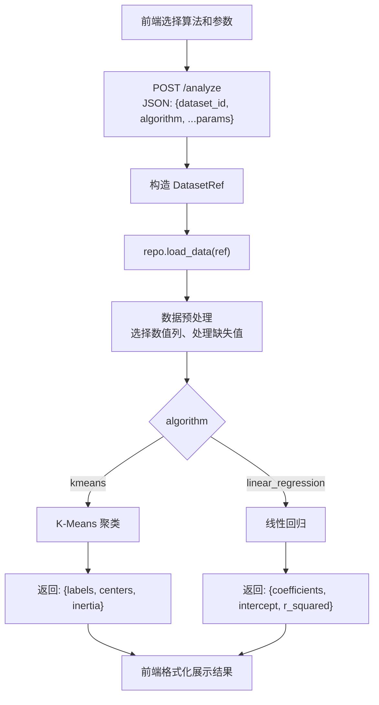
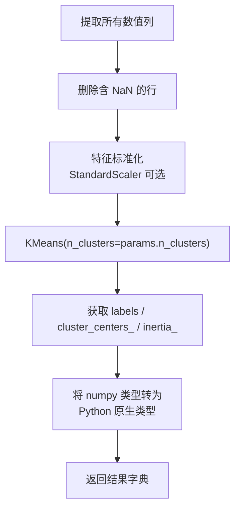
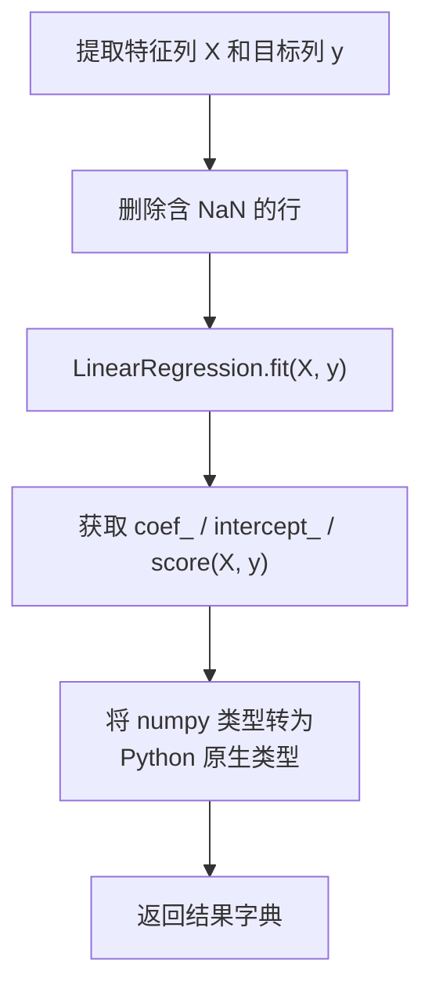

# 分析功能模块 - 开发文档

**负责人**：分析功能模块开发人员

---

## 一、模块概述

分析功能模块负责提供机器学习分析能力。MVP 阶段至少实现一种算法：

1. **K-Means 聚类** - 对数据进行聚类，返回聚类标签、中心点和评估指标
2. **线性回归**（可选，有能力的可同时实现） - 预测目标变量，返回系数和评估指标

### 算法选择建议

| 算法 | 适用数据 | 输出 |
|------|---------|------|
| K-Means | 无标签的数值数据 | 聚类标签、中心点、惯性 |
| 线性回归 | 有特征和目标列的数值数据 | 系数、截距、R² |

### 层间定位

```
表示层（前端）
    ↓ HTTP API (/analyze)
【控制层】 routes/analyze.py                     ← 你在这里实现路由
    ↓ Python 函数调用
【业务层】 services/analyze_service.py           ← 你在这里实现业务逻辑
    ↓ DataRepository 抽象接口
【数据访问层】 repositories/file_repo.py         ← 数据管理模块实现，你只通过接口调用
```

---

## 二、涉及文件清单

| 文件 | 操作类型 | 说明 |
|------|---------|------|
| `services/analyze_service.py` | **实现** | 分析核心逻辑：K-Means/线性回归 |
| `routes/analyze.py` | **实现** | `POST /analyze` 路由处理 |
| `static/js/analyze.js` | **实现** | 前端分析参数配置和结果展示 |
| `value_objects.py` | 只读引用 | `DatasetRef` |
| `repositories/base.py` | 只读引用 | `DataRepository` 抽象接口 |

---

## 三、核心流程

### 3.1 分析总流程



### 3.2 K-Means 聚类子流程



### 3.3 线性回归子流程



---

## 四、详细实现要求

### 4.1 AnalyzeService.analyze() - 主入口

**文件**: `services/analyze_service.py`

**方法签名**: `analyze(self, dataset_ref: DatasetRef, algorithm: str, params: dict) -> dict`

**实现步骤**:

```python
def analyze(self, dataset_ref, algorithm, params):
    # 1. 加载数据
    df = self.repo.load_data(dataset_ref)

    # 2. 按算法分发
    if algorithm == "kmeans":
        return self._kmeans_analysis(df, params)
    elif algorithm == "linear_regression":
        return self._linear_regression_analysis(df, params)
    else:
        raise ValueError(f"不支持的算法: {algorithm}")
```

### 4.2 K-Means 聚类实现

```python
from sklearn.cluster import KMeans
from sklearn.preprocessing import StandardScaler


def _kmeans_analysis(self, df: pd.DataFrame, params: dict) -> dict:
    # 参数
    n_clusters = params.get("n_clusters", 3)

    # 数据预处理：选择数值列，删除 NaN
    numeric_df = df.select_dtypes(include=[np.number]).dropna()

    if len(numeric_df) < n_clusters:
        raise ValueError(f"有效样本数 ({len(numeric_df)}) 少于聚类数 ({n_clusters})")

    # 可选：标准化
    # scaler = StandardScaler()
    # X_scaled = scaler.fit_transform(numeric_df)
    X = numeric_df.values

    # 执行聚类
    kmeans = KMeans(n_clusters=n_clusters, random_state=42, n_init=10)
    kmeans.fit(X)

    # 返回结果（注意：numpy 类型需要转为 Python 原生类型）
    return {
        "labels": kmeans.labels_.tolist(),                    # list[int]
        "centers": kmeans.cluster_centers_.tolist(),           # list[list[float]]
        "inertia": float(kmeans.inertia_),                     # float
    }
```

### 4.3 线性回归实现

```python
from sklearn.linear_model import LinearRegression


def _linear_regression_analysis(self, df: pd.DataFrame, params: dict) -> dict:
    feature_cols = params.get("feature_cols", [])
    target_col = params.get("target_col", "")

    # 校验
    if not feature_cols or not target_col:
        raise ValueError("线性回归需要指定 feature_cols 和 target_col")
    for col in feature_cols:
        if col not in df.columns:
            raise ValueError(f"特征列 '{col}' 不存在")
    if target_col not in df.columns:
        raise ValueError(f"目标列 '{target_col}' 不存在")

    # 提取特征和目标，删除 NaN
    subset = df[feature_cols + [target_col]].dropna()
    X = subset[feature_cols].values
    y = subset[target_col].values

    if len(subset) < 2:
        raise ValueError("有效样本数不足，无法进行回归分析")

    # 执行回归
    model = LinearRegression()
    model.fit(X, y)

    return {
        "coefficients": model.coef_.tolist(),      # list[float]
        "intercept": float(model.intercept_),       # float
        "r_squared": float(model.score(X, y)),      # float
    }
```

### 4.4 POST /analyze 路由

**文件**: `routes/analyze.py`

```python
@analyze_bp.route("/analyze", methods=["POST"])
def analyze():
    params = request.get_json()

    # 校验必填字段
    if "dataset_id" not in params:
        return jsonify({"status": "error", "message": "缺少 dataset_id"}), 400
    if "algorithm" not in params:
        return jsonify({"status": "error", "message": "缺少 algorithm"}), 400

    dataset_ref = DatasetRef(params["dataset_id"])
    algorithm = params.pop("algorithm")  # 从 params 中移除 algorithm

    analyze_service = current_app.analyze_service
    result = analyze_service.analyze(dataset_ref, algorithm, params)

    return jsonify({"status": "success", "data": result})
```

> **注意**: `params.pop("algorithm")` 后，`params` 中剩余的字段（如 `n_clusters`、`feature_cols`、`target_col`）会直接传入 `analyze()` 作为算法参数。

---

## 五、前端对应代码

**文件**: `static/js/analyze.js`

```javascript
// analyze.js - 分析功能模块前端逻辑

function populateAlgorithmParams(algorithm) {
    const container = document.getElementById("algorithm-params");
    container.innerHTML = "";

    if (algorithm === "kmeans") {
        // 显示 K 值滑动条
        container.innerHTML = `
            <div class="mb-3">
                <label class="form-label">聚类数 (K)</label>
                <input type="range" class="form-range" id="k-slider"
                       min="2" max="10" value="3" />
                <span id="k-value" class="badge bg-secondary">3</span>
            </div>
        `;
        // 绑定滑动条事件
        document.getElementById("k-slider").addEventListener("input", function() {
            document.getElementById("k-value").textContent = this.value;
        });
    } else if (algorithm === "linear_regression") {
        // 显示特征列和目标列选择
        // 【待实现】从 currentColumns 生成复选框列表
    }
}

async function handleAnalyze(datasetId) {
    const algorithm = document.getElementById("algorithm-type").value;
    let params = { dataset_id: datasetId, algorithm };

    if (algorithm === "kmeans") {
        params.n_clusters = parseInt(document.getElementById("k-slider").value);
    } else if (algorithm === "linear_regression") {
        // 收集选中的特征列和目标列
    }

    const result = await postJSON("/analyze", params);
    if (result.status === "error") {
        alert("分析失败: " + result.message);
        return;
    }

    // 格式化显示结果
    document.getElementById("analyze-result").style.display = "block";
    document.getElementById("analyze-result-content").textContent =
        JSON.stringify(result.data, null, 2);
}
```

---

## 六、依赖的通用组件（由数据管理模块实现，你只需了解接口）

```python
repo.load_data(ref)       # → DataFrame
DatasetRef(id_str)        # 构造引用
```

---

## 七、验收标准

### K-Means 聚类
- [ ] 正确选择数值列，自动跳过非数值列
- [ ] K 值参数可调（2-10），前端通过滑动条控制
- [ ] 返回 labels（每个样本的簇标签）、centers（簇中心坐标）、inertia（簇内平方和）
- [ ] 结果中的 numpy 类型已转为 Python 原生类型（`tolist()` / `float()`）

### 线性回归（如实现）
- [ ] 支持多特征列和目标列选择
- [ ] 返回 coefficients、intercept、r_squared
- [ ] 有效样本数不足时给出明确错误

---

## 八、常见问题

**Q: 数据标准化是否必要？**
A: K-Means 对特征尺度敏感，如果各列的量级差异很大（如 年龄 0-100 vs 收入 0-100000），建议使用 `StandardScaler` 标准化。

**Q: `n_init=10` 和 `random_state=42` 有什么用？**
A: `n_init` 指定 K-Means 用不同初始化运行的次数，取最优结果。`random_state` 固定随机种子，确保结果可复现。

**Q: 为什么返回前要调用 `tolist()`？**
A: scikit-learn 返回的是 numpy 数组，Flask 的 `jsonify` 无法直接序列化 numpy 类型。需要用 `.tolist()` 转为 Python list，`float()` 转为 Python float。

**Q: 如果用户选择的两列完全相同会怎样？**
A: K-Means 仍然可以运行，但聚类效果没有意义。在前端层面可加提示，但不是阻塞性错误。
