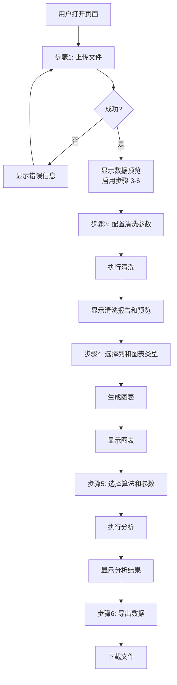

# Web界面模块 - 开发文档

**负责人**：Web界面模块开发人员

---

## 一、模块概述

Web界面模块负责整个系统的前端呈现和交互体验。你不需要关心后端业务逻辑，但需要与其他模块开发人员协调前端 JS 函数的对接接口。

### 前端架构

```
templates/index.html      ← 页面结构（你负责）
static/css/style.css      ← 样式（你负责）
static/js/
├── app.js                ← 主控逻辑（你负责）
├── upload.js             ← 上传模块 JS（由数据管理开发人员实现）
├── clean.js              ← 清洗模块 JS（由数据清洗开发人员实现）
├── plot.js               ← 图表模块 JS（由可视化开发人员实现）
└── analyze.js            ← 分析模块 JS（由分析功能开发人员实现）
```

### 你的职责

1. **HTML 结构** - 完善 `index.html` 的页面布局
2. **CSS 样式** - 实现美观、响应式的 UI 样式
3. **主控 JS** - 控制整个应用流程、导航步骤、错误显示、状态管理
4. **集成对接** - 调用其他模块 JS 文件中的函数，串联完整流程

### 层间定位

```
【表示层】templates/index.html + static/css/style.css + static/js/app.js
             ← 你负责所有前端代码
    ↓ 仅调用 HTTP API
【控制层】Flask 路由（其他开发人员实现）
```

---

## 二、涉及文件清单

| 文件 | 操作类型 | 说明 |
|------|---------|------|
| `templates/index.html` | **实现** | 完整页面结构，已提供骨架 |
| `static/css/style.css` | **实现** | 所有样式，已提供基本样式 |
| `static/js/app.js` | **实现** | 主控逻辑，已提供骨架 |
| `static/js/upload.js` | **对接** | 由数据管理模块开发人员实现，你调用其暴露的函数 |
| `static/js/clean.js` | **对接** | 由数据清洗模块开发人员实现，你调用 |
| `static/js/plot.js` | **对接** | 由可视化模块开发人员实现，你调用 |
| `static/js/analyze.js` | **对接** | 由分析功能模块开发人员实现，你调用 |

> **关键原则**: 你不修改其他模块的 JS 文件，只通过约定的函数名调用他们的代码。

---

## 三、交互流程

### 3.1 完整用户流程



### 3.2 界面布局

```
┌──────────────────────────────────────────────────┐
│  交互式数据分析系统                                │
│  上传 → 清洗 → 可视化 → 分析 → 导出              │
├──────────────────────────────────────────────────┤
│  ┌─ 1. 上传数据 ──────────────────────────────┐ │
│  │  [选择文件...] [上传]                       │ │
│  └─────────────────────────────────────────────┘ │
│  ┌─ 2. 数据预览 ──────────────────────────────┐ │
│  │  100行 × 5列          ┌───┬───┬───┐       │ │
│  │                       │ A │ B │ C │       │ │
│  │                       ├───┼───┼───┤       │ │
│  │                       │ 1 │ 2 │ 3 │       │ │
│  │                       └───┴───┴───┘       │ │
│  └─────────────────────────────────────────────┘ │
│  ┌─ 3. 数据清洗 ──────────────────────────────┐ │
│  │  列A: [均值填充 ▼]    异常值: [IQR ▼]     │ │
│  │  列B: [不处理 ▼]      [执行清洗]          │ │
│  └─────────────────────────────────────────────┘ │
│  ┌─ 4. 可视化 ──────────────────────────────┐ │
│  │  X: [列A ▼]  Y: [列B ▼]  类型: [散点 ▼] │ │
│  │  [生成图表]                              │ │
│  │  ┌──────────────────────────────────┐    │ │
│  │  │          [图表区域]              │    │ │
│  │  └──────────────────────────────────┘    │ │
│  └─────────────────────────────────────────────┘ │
│  ┌─ 5. 分析 ────────────────────────────────┐ │
│  │  算法: [K-Means ▼]  K值: [===●=====] 3 │ │
│  │  [执行分析]                             │ │
│  │  结果: {...}                             │ │
│  └─────────────────────────────────────────────┘ │
│  ┌─ 6. 导出 ────────────────────────────────┐ │
│  │  [导出CSV] [导出Excel]                    │ │
│  └─────────────────────────────────────────────┘ │
└──────────────────────────────────────────────────┘
```

---

## 四、详细实现要求

### 4.1 index.html 完善

当前骨架已包含基本结构，你需要：

1. **步骤渐进式显示** - 初始只显示步骤1，后续步骤在上传成功后逐一显示
2. **图表容器** - 确保 `<div id="plot-container">` 有足够的高度（建议 min-height: 400px）
3. **加载状态** - 添加加载中的动画元素（spinner）
4. **错误提示** - 添加全局错误提示区域
5. **Plotly CDN**（如果可视化模块选择 Plotly 方案）- 在 `<head>` 中添加 Plotly.js CDN

```html
<!-- 错误提示区域（固定在页面顶部） -->
<div id="error-toast" class="alert alert-danger d-none position-fixed top-0 start-50 translate-middle-x" style="z-index: 9999;">
</div>

<!-- 图表容器需确保高度 -->
<div id="plot-container" class="mt-3" style="min-height: 400px; display:none;"></div>
```

### 4.2 CSS 样式完善

| 要求 | 说明 |
|------|------|
| 响应式布局 | 适配常见 PC 分辨率（1280px ~ 1920px） |
| 步骤卡片 | 每个步骤用 Bootstrap card，上传完成前后续步骤不可见 |
| 表格样式 | 预览表格支持横向滚动和垂直滚动（max-height） |
| 按钮状态 | 按钮在加载时显示 disabled 和 spinner |
| 报错样式 | 错误信息使用红色背景/红色边框醒目显示 |

### 4.3 app.js 主控逻辑

这是你的核心工作。你需要：

#### 全局状态管理

```javascript
// 全局状态（独立变量，Web 界面模块维护）
let currentDatasetId = null;   // 当前操作的数据集 ID
let currentColumns = [];       // 当前数据集的列名

// 工具函数：统一错误显示
function showError(message) {
    const toast = document.getElementById("error-toast");
    toast.textContent = message;
    toast.classList.remove("d-none");
    setTimeout(() => toast.classList.add("d-none"), 5000);
}

// 工具函数：统一 JSON POST
async function postJSON(url, data) {
    const response = await fetch(url, {
        method: "POST",
        headers: { "Content-Type": "application/json" },
        body: JSON.stringify(data),
    });
    return response.json();
}
```

#### 步骤控制

完成上传后启用后续步骤：
function onUploadSuccess(data) {
    currentDatasetId = data.dataset_id;
    currentColumns = data.columns;

    // 显示后续步骤
    document.getElementById("step-preview").style.display = "block";
    document.getElementById("step-clean").style.display = "block";
    document.getElementById("step-visualize").style.display = "block";
    document.getElementById("step-analyze").style.display = "block";
    document.getElementById("step-export").style.display = "block";

    // 调用各模块的初始化函数
    if (typeof populateCleanOptions === "function") {
        populateCleanOptions(data.columns);
    }
    if (typeof populatePlotColumns === "function") {
        populatePlotColumns(data.columns);
    }
}
```

#### 事件绑定

```javascript
// 上传按钮
document.getElementById("btn-upload").addEventListener("click", async function() {
    const file = document.getElementById("file-input").files[0];
    if (!file) return;

    try {
        const data = await handleUpload(file);
        onUploadSuccess(data);
    } catch (err) {
        showError("上传失败: " + err.message);
    }
});

// 清洗按钮
document.getElementById("btn-clean").addEventListener("click", async function() {
    if (!currentDatasetId) return;

    const params = collectCleanParams();
    params.dataset_id = currentDatasetId;

    try {
        const result = await handleClean(params);
        currentDatasetId = result.dataset_id;
        // 更新预览和显示报告
    } catch (err) {
        showError("清洗失败: " + err.message);
    }
});
```

#### 与其他模块 JS 的接口约定

各模块 JS 文件暴露以下函数供你调用：

| JS 文件 | 暴露的函数 | 调用时机 |
|---------|-----------|---------|
| `upload.js` | `handleUpload(file) → data` | 点击上传按钮 |
| `upload.js` | `renderPreview(data)` | 上传成功 |
| `upload.js` | `handleExport(datasetId, format)` | 点击导出按钮 |
| `clean.js` | `populateCleanOptions(columns)` | 上传成功后 |
| `clean.js` | `collectCleanParams() → params` | 点击清洗按钮时 |
| `clean.js` | `handleClean(params) → result` | 收集参数后 |
| `plot.js` | `populatePlotColumns(columns)` | 上传成功后 |
| `plot.js` | `handlePlot(datasetId)` | 点击生成图表 |
| `analyze.js` | `handleAnalyze(datasetId)` | 点击执行分析 |
| `analyze.js` | `populateAlgorithmParams(algorithm)` | 切换算法时 |

---

## 五、技术选型

### 核心框架

- **Bootstrap 5** - 页面布局和组件（已引入 CDN）
- **原生 JavaScript** - 无需额外框架，Keep it simple

### 推荐库（按需添加 CDN）

```html
<!-- 如果可视化模块使用 Plotly -->
<script src="https://cdn.plot.ly/plotly-2.32.0.min.js"></script>

<!-- 如果需要图表/表格增强 -->
<!-- 无额外需求可不加 -->
```

### 开发原则

1. **不直接调用后端 API 以外的代码** - 所有数据交互通过 HTTP API
2. **不实现业务逻辑** - 清洗、分析等算法在后端实现
3. **状态由前端维护** - `currentDatasetId` 在 JS 中管理，每次请求携带

---

## 六、验收标准

- [ ] 页面打开时只显示上传步骤，其他步骤隐藏
- [ ] 上传成功后逐步显示预览、清洗、可视化、分析、导出步骤
- [ ] 响应式布局，在 1280px~1920px 分辨率下布局合理
- [ ] 预览表格支持横向滚动，表头固定
- [ ] 清洗参数每列独立配置，下拉框选项正确
- [ ] 图表容器有足够高度（min-height: 400px），图片正常显示
- [ ] 错误信息醒目显示（红色背景/边框）
- [ ] 加载状态有视觉反馈（spinner/disabled 按钮）
- [ ] 导出按钮正确跳转到下载链接
- [ ] 无需刷新页面即可完成 上传→清洗→可视化→分析→导出 完整流程
- [ ] 每次操作传递正确的 dataset_id

---

## 七、与其他开发人员的协作方式

1. **约定接口在前，各自实现在后**
   - 你与各模块开发人员确认 JS 函数名和参数格式
   - 接口确定后各自独立实现

2. **Mock 数据调试**
   - 在其他模块未完成时，你可以准备 Mock 数据测试前端流程
   - 例如，在 `app.js` 中添加临时 Mock:
   ```javascript
   // Mock: 在其他模块未完成时测试前端流程
   async function handleUpload(file) {
       return {
           dataset_id: "mock-" + Date.now(),
           columns: ["年龄", "收入", "评分"],
           preview: [[25, 5000, 4.5], [30, 8000, 4.2]],
           shape: [100, 3],
           dtypes: {"年龄": "int64", "收入": "int64", "评分": "float64"},
       };
   }
   ```

3. **集成测试**
   - 所有模块完成后，你负责端到端测试完整流程

---

## 八、常见问题

**Q: 如何确保 dataset_id 在流程中正确传递？**
A: 你维护的 `currentDatasetId` 会在每次操作后更新（清洗和分析会生成新的 dataset_id），确保导出时使用的是最新的 ID。

**Q: 其他模块的 JS 还没写完，我怎么开发？**
A: 使用 Mock 数据模拟各模块返回值，测试前端的流程控制和界面展示。接口约定好后，Mock 数据和真实数据互换只需要改函数实现。

**Q: 页面是否需要 SPA（单页应用）效果？**
A: 是的，整个流程在同一页面完成，无页面刷新。使用 `fetch` API 异步请求后端。
