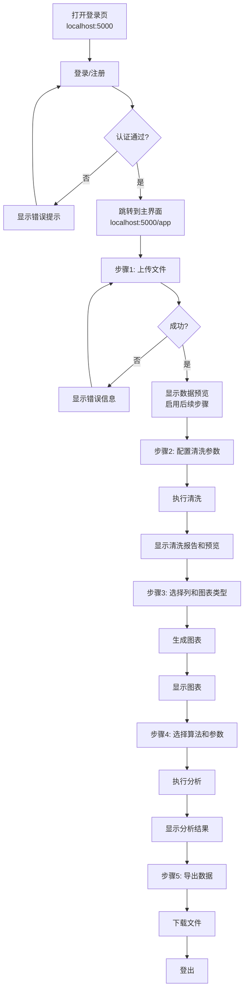

# Web界面模块 - 开发文档

**负责人**：Web界面模块开发人员

---

## 一、模块概述

Web界面模块负责整个系统的前端呈现和交互体验。你不需要关心后端业务逻辑，但需要与其他模块开发人员协调前端 JS 函数的对接接口。

> **状态**：✅ 已完成。当前系统包含登录页（`login.html`）+ 主界面（`index.html`），全流程无需刷新。

### 前端架构

```
templates/
├── login.html            ← 登录/注册页（星空螺旋动画 + 认证表单）
└── index.html            ← 主界面（侧边栏 + 五个功能面板）
static/css/style.css      ← 样式（Cyber-luxury 暗色主题）
static/js/
├── app.js                ← 主控逻辑（导航切换、toast 提示、截图、登出）
├── upload.js             ← 上传模块 JS（由数据管理模块开发人员实现）
├── clean.js              ← 清洗模块 JS（由数据清洗模块开发人员实现）
├── plot.js               ← 图表模块 JS（由可视化模块开发人员实现）
└── analyze.js            ← 分析模块 JS（由分析功能模块开发人员实现）
```

### 你的职责

1. **HTML 结构** - 完善 `index.html` 的页面布局
2. **CSS 样式** - 实现美观、响应式的 UI 样式
3. **主控 JS** - 控制整个应用流程、导航步骤、错误显示、状态管理
4. **集成对接** - 调用其他模块 JS 文件中的函数，串联完整流程

### 层间定位

```
【表示层】templates/index.html + static/css/style.css + static/js/app.js
             ← 你负责所有前端代码
    ↓ 仅调用 HTTP API
【控制层】Flask 路由（其他开发人员实现）
```

---

## 二、涉及文件清单

| 文件 | 操作类型 | 说明 |
|------|---------|------|
| `templates/login.html` | **实现** | 登录/注册页（星空动画 + 认证表单） |
| `templates/index.html` | **实现** | 主界面（侧边栏 + 五个功能面板） |
| `static/css/style.css` | **实现** | Cyber-luxury 暗色主题样式 |
| `static/js/app.js` | **实现** | 主控逻辑（导航切换、toast、截图、登出） |
| `static/js/upload.js` | **对接** | 由数据管理模块开发人员实现，你调用其暴露的函数 |
| `static/js/clean.js` | **对接** | 由数据清洗模块开发人员实现，你调用 |
| `static/js/plot.js` | **对接** | 由可视化模块开发人员实现，你调用 |
| `static/js/analyze.js` | **对接** | 由分析功能模块开发人员实现，你调用 |

> **关键原则**: 你不修改其他模块的 JS 文件，只通过约定的函数名调用他们的代码。

---

## 三、交互流程

### 3.1 完整用户流程



### 3.2 界面布局

```
┌──────────────────────────────────────────────────┐
│  交互式数据分析系统                                │
│  上传 → 清洗 → 可视化 → 分析 → 导出              │
├──────────────────────────────────────────────────┤
│  ┌─ 1. 上传数据 ──────────────────────────────┐ │
│  │  [选择文件...] [上传]                       │ │
│  └─────────────────────────────────────────────┘ │
│  ┌─ 2. 数据预览 ──────────────────────────────┐ │
│  │  100行 × 5列          ┌───┬───┬───┐       │ │
│  │                       │ A │ B │ C │       │ │
│  │                       ├───┼───┼───┤       │ │
│  │                       │ 1 │ 2 │ 3 │       │ │
│  │                       └───┴───┴───┘       │ │
│  └─────────────────────────────────────────────┘ │
│  ┌─ 3. 数据清洗 ──────────────────────────────┐ │
│  │  列A: [均值填充 ▼]    异常值: [IQR ▼]     │ │
│  │  列B: [不处理 ▼]      [执行清洗]          │ │
│  └─────────────────────────────────────────────┘ │
│  ┌─ 4. 可视化 ──────────────────────────────┐ │
│  │  X: [列A ▼]  Y: [列B ▼]  类型: [散点 ▼] │ │
│  │  [生成图表]                              │ │
│  │  ┌──────────────────────────────────┐    │ │
│  │  │          [图表区域]              │    │ │
│  │  └──────────────────────────────────┘    │ │
│  └─────────────────────────────────────────────┘ │
│  ┌─ 5. 分析 ────────────────────────────────┐ │
│  │  算法: [K-Means ▼]  K值: [===●=====] 3 │ │
│  │  [执行分析]                             │ │
│  │  结果: {...}                             │ │
│  └─────────────────────────────────────────────┘ │
│  ┌─ 6. 导出 ────────────────────────────────┐ │
│  │  [导出CSV] [导出Excel]                    │ │
│  └─────────────────────────────────────────────┘ │
└──────────────────────────────────────────────────┘
```

---

## 四、详细实现要求

### 4.1 index.html 完善

当前已实现的结构包含两个页面：

**登录页（`login.html`）**：
- 全屏螺旋星空动画（Three.js 风格粒子系统）
- GSAP 时间线驱动的英雄区浮现动画
- 登录/注册模式切换（确认密码输入框显隐）
- Enter 键提交支持
- Session 登录态维护

**主界面（`index.html`）**：
- 左侧导航栏（数据导入、清洗、可视化、分析、历史记录）
- 五个面板通过 `data-view` 属性切换显示
- Plotly.js CDN（`plotly-2.32.0.min.js`）支持交互式图表
- 错误/成功 toast 提示（自动消失）
- 用户信息栏 + 登出按钮
- 粒子背景动画 + 噪声叠加层
- 系统状态指示

关键元素 ID：
```html
<!-- 错误提示 -->
<div id="error-toast" class="error-toast" style="display:none;">...</div>
<!-- 成功提示 -->
<div id="success-toast" class="success-toast" style="display:none;">...</div>
<!-- 图表容器 -->
<div id="plot-container" class="plot-container" style="display:none;">
    <div id="plotly-chart"></div>
</div>
```

### 4.2 CSS 样式完善

| 要求 | 说明 |
|------|------|
| 响应式布局 | 适配常见 PC 分辨率（1280px ~ 1920px） |
| 步骤卡片 | 每个步骤用 Bootstrap card，上传完成前后续步骤不可见 |
| 表格样式 | 预览表格支持横向滚动和垂直滚动（max-height） |
| 按钮状态 | 按钮在加载时显示 disabled 和 spinner |
| 报错样式 | 错误信息使用红色背景/红色边框醒目显示 |

### 4.3 app.js 主控逻辑

这是你的核心工作。

#### 全局状态管理（当前实现）

当前 `app.js` 管理以下全局状态：

| 变量 | 类型 | 用途 |
|------|------|------|
| `currentDatasetId` | string | 当前操作的数据集 ID，每次清洗/分析后更新 |
| `currentColumns` | string[] | 当前数据集的列名，用于各模块下拉框填充 |

工具函数：`postJSON(url, data)` 统一封装 fetch POST 请求，`showError(msg)` / `showSuccess(msg)` 使用 toast 样式提示。

上传成功后，`app.js` 调用各模块初始化函数：
```javascript
function onUploadSuccess(data) {
    currentDatasetId = data.dataset_id;
    currentColumns = data.columns;

    // 显示后续步骤
    document.getElementById("step-preview").style.display = "block";
    document.getElementById("step-clean").style.display = "block";
    document.getElementById("step-visualize").style.display = "block";
    document.getElementById("step-analyze").style.display = "block";
    document.getElementById("step-export").style.display = "block";

    // 调用各模块的初始化函数
    if (typeof populateCleanOptions === "function") {
        populateCleanOptions(data.columns);
    }
    if (typeof populatePlotColumns === "function") {
        populatePlotColumns(data.columns);
    }
}
```

#### 全局状态管理（当前实现）

当前 `app.js` 管理以下全局状态：

| 变量 | 类型 | 用途 |
|------|------|------|
| `currentDatasetId` | string | 当前操作的数据集 ID，每次清洗/分析后更新 |
| `currentColumns` | string[] | 当前数据集的列名，用于各模块下拉框填充 |

工具函数：`postJSON(url, data)` 统一封装 fetch POST 请求，`showError(msg)` / `showSuccess(msg)` 使用 toast 样式提示。

#### 事件绑定（当前实现）

```javascript
// 上传
document.getElementById("btn-upload").addEventListener("click", async function() {
    const file = document.getElementById("file-input").files[0];
    if (!file) return;
    try {
        const data = await handleUpload(file);
        currentDatasetId = data.dataset_id;
        currentColumns = data.columns;
        renderPreview(data);
        populateCleanOptions(data.columns);
        populatePlotColumns(data.columns);
    } catch (err) {
        showError("上传失败: " + err.message);
    }
});

// 清洗 — 成功后更新 dataset_id
document.getElementById("btn-clean").addEventListener("click", async function() {
    if (!currentDatasetId) return;
    const params = collectCleanParams();
    params.dataset_id = currentDatasetId;
    try {
        const result = await handleClean(params);
        currentDatasetId = result.dataset_id;
        // 渲染新数据集预览 + 显示清洗报告
    } catch (err) {
        showError("清洗失败: " + err.message);
    }
});

// 可视化 — handlePlot() 内部通过 DOM 获取 XY 列值
document.getElementById("btn-plot").addEventListener("click", async function() {
    if (!currentDatasetId) return;
    try {
        const result = await handlePlot(currentDatasetId);
        if (!result) return;  // 失败时 handlePlot 返回 null
        // 可选：使用 Plotly 截图功能
    } catch (err) {
        showError("生成图表失败: " + (err.message || "未知错误"));
    }
});
```

#### 与其他模块 JS 的接口约定

各模块 JS 文件暴露以下函数供你调用：

| JS 文件 | 暴露的函数 | 调用时机 | 状态 |
|---------|-----------|---------|:----:|
| `upload.js` | `handleUpload(file) → data` | 点击上传按钮 | ✅ |
| `upload.js` | `renderPreview(data)` | 上传成功 | ✅ |
| `upload.js` | `handleExport(datasetId, format)` | 点击导出按钮 | ✅ |
| `clean.js` | `populateCleanOptions(columns)` | 上传成功后 | ✅ |
| `clean.js` | `collectCleanParams() → params` | 点击清洗按钮时 | ✅ |
| `clean.js` | `handleClean(params) → result` | 收集参数后 | ✅ |
| `plot.js` | `populatePlotColumns(columns)` | 上传成功后 | ✅ |
| `plot.js` | `handlePlot(datasetId)` | 点击生成图表 | ✅ |
| `analyze.js` | `handleAnalyze(datasetId)` | 点击执行分析 | ✅ 前端 |
| `analyze.js` | `populateAlgorithmParams(algorithm)` | 切换算法时 | ✅ 前端 |

---

## 五、技术选型

### 核心框架

- **Bootstrap 5** - 页面布局和组件（已引入 CDN）
- **GSAP** - 登录页动画（星空螺旋 + 英雄区浮现）
- **Plotly.js 2.32.0** - 交互式图表渲染
- **原生 JavaScript** - 应用主逻辑，keep it simple

### CDN 依赖

```html
<!-- 已引入 -->
<script src="https://cdn.plot.ly/plotly-2.32.0.min.js"></script>
<script src="https://cdnjs.cloudflare.com/ajax/libs/gsap/3.12.5/gsap.min.js"></script>
<link rel="stylesheet" href="https://cdn.jsdelivr.net/npm/bootstrap@5.3.0/dist/css/bootstrap.min.css" />
```

### 开发原则

1. **不直接调用后端 API 以外的代码** - 所有数据交互通过 HTTP API
2. **不实现业务逻辑** - 清洗、分析等算法在后端实现
3. **状态由前端维护** - `currentDatasetId` 在 JS 中管理，每次请求携带
4. **认证态由 Flask session 维护** - 未登录自动跳转回登录页

---

## 六、验收标准

- [x] 登录页显示星空动画和认证表单，登录/注册模式切换正常
- [x] 登录成功后跳转到主界面 `/app`，侧边栏五个面板可切换
- [x] 上传数据后预览表格正确显示，列名、行数、数据类型可见
- [x] 响应式布局，在 1280px~1920px 分辨率下布局合理
- [x] 预览表格支持横向滚动，表头固定
- [x] 清洗参数每列独立配置，下拉框选项正确，清洗报告完整
- [x] 图表容器 Plotly.newPlot 渲染，支持悬停提示和缩放
- [x] 错误/成功 toast 醒目显示，自动消失
- [x] 加载状态有视觉反馈（spinner / disabled 按钮）
- [x] 导出按钮正确下载 CSV / Excel 文件
- [x] 无需刷新页面即可完成 上传→清洗→可视化→分析→导出 完整流程
- [x] 每次操作传递正确的 dataset_id（清洗后更新）
- [x] 登出后清除 session，返回登录页

---

## 七、与其他开发人员的协作方式

1. **约定接口在前，各自实现在后**
   - 你与各模块开发人员确认 JS 函数名和参数格式
   - 接口确定后各自独立实现

2. **集成测试**
   - 所有模块完成后，你负责端到端测试完整流程
   - 当前所有模块（除分析功能后端）均已完成并集成

---

## 八、常见问题

**Q: 如何确保 dataset_id 在流程中正确传递？**
A: 你维护的 `currentDatasetId` 会在每次操作后更新（清洗和分析会生成新的 dataset_id），确保导出时使用的是最新的 ID。

**Q: 其他模块的 JS 还没写完，我怎么开发？**
A: 使用 Mock 数据模拟各模块返回值，测试前端的流程控制和界面展示。接口约定好后，Mock 数据和真实数据互换只需要改函数实现。

**Q: 页面是否需要 SPA（单页应用）效果？**
A: 是的，整个流程在同一页面完成，无页面刷新。使用 `fetch` API 异步请求后端。
